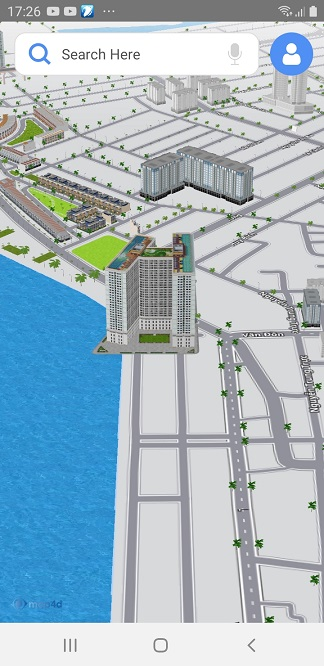
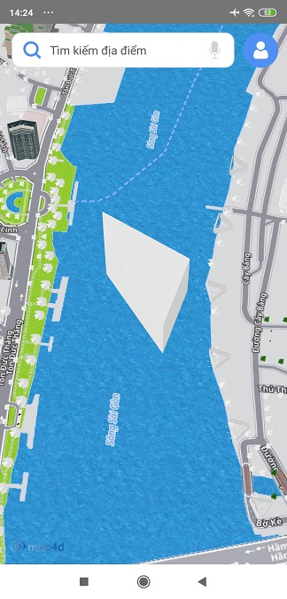

# Building

Điểm khác biệt giữa nền tảng bản đồ **map4d** với các nền tảng bản đồ khác đó là chế độ bản đồ 3D. Chế độ này sẽ có các đối
tượng 3D mô phỏng lại các tòa nhà, cây cối, các cây cầu cũng như các công trình kiến trúc khác, ... Ngoài những đối tượng building
3D có sẵn của bản đồ, bạn còn có thể tự tạo và thêm đối tượng 3D của bạn lên bản đồ thông qua đối tượng **map4d.Building**

**Chú ý: Những đối tượng Building này chỉ được vẽ trong chế độ 3D của bản đồ, nó không được vẽ trong chế độ 2D.**

### 1. Tạo Building


  
<!-- tabs:start -->
#### ** Kotlin **
```kotlin
    map4D?.setBuildingsEnabled(true)
    val buildingOptions = MFBuildingOptions()
    buildingOptions.location(MFLocationCoordinate(16.088987, 108.227940))
      .name("Test Building")
      .model("https://hcm03.vstorage.vngcloud.vn/v1/AUTH_b32b6bc102c44269ab7b55e7820e7116/sdk/models/5db6b4798b4711141457d8a9.obj")
      .texture("https://hcm03.vstorage.vngcloud.vn/v1/AUTH_b32b6bc102c44269ab7b55e7820e7116/sdk/textures/5db6b4798b4711141457d8ab.jpg")
    map4D?.addBuilding(buildingOptions)
```
#### ** Java **
```java
    map4D?.setBuildingsEnabled(true);
    MFBuildingOptions buildingOptions = new MFBuildingOptions();
    buildingOptions.location(new MFLocationCoordinate(16.088987, 108.227940))
     .name("Test Building")
     .model("https://hcm03.vstorage.vngcloud.vn/v1/AUTH_b32b6bc102c44269ab7b55e7820e7116/sdk/models/5db6b4798b4711141457d8a9.obj")
     .texture("https://hcm03.vstorage.vngcloud.vn/v1/AUTH_b32b6bc102c44269ab7b55e7820e7116/sdk/textures/5db6b4798b4711141457d8ab.jpg");
    map4D.addBuilding(buildingOptions);
```
<!-- tabs:end -->

### 2. Tạo Extrude Building


  
<!-- tabs:start -->
#### ** Kotlin **
```kotlin
    val extrudeBuildingOptions = MFBuildingOptions()
      .location(MFLocationCoordinate(10.774544, 106.707764))
      .name("Extrude Building")
      .model(
        listOf(MFLocationCoordinate(10.774544, 106.707764), MFLocationCoordinate(10.773766, 106.709001),
        MFLocationCoordinate(10.772759, 106.708627), MFLocationCoordinate( 10.774045, 106.707806)))
      .height(100.0)
    map4D?.addBuilding(extrudeBuildingOptions)
    map4D?.moveCamera(MFCameraUpdateFactory.newCoordinate(MFLocationCoordinate(10.774544, 106.707764)))
```
#### ** Java **
```java
    map4D.setBuildingsEnabled(true);
    MFBuildingOptions extrudeBuildingOptions = new MFBuildingOptions();
    extrudeBuildingOptions.location(new MFLocationCoordinate(10.774544, 106.707764))
      .name("Extrude Building")
      .model(
        new ArrayList<MFLocationCoordinate>(Arrays.asList(new MFLocationCoordinate(10.774544, 106.707764), new MFLocationCoordinate(10.773766, 106.709001),
          new MFLocationCoordinate(10.772759, 106.708627), new MFLocationCoordinate( 10.774045, 106.707806))))
      .height(100.0);
    map4D.addBuilding(extrudeBuildingOptions);
    map4D.moveCamera(MFCameraUpdateFactory.newCoordinate(new MFLocationCoordinate(10.774544, 106.707764)));
```
<!-- tabs:end -->

### 3. Xóa Building khỏi bản đồ

Để xóa một building ra khỏi bản đồ, hãy gọi phương thức **remove()**

<!-- tabs:start -->
#### ** Kotlin **
```kotlin
    building.remove()
```
#### ** Java **
```java
    building.remove();
```
<!-- tabs:end -->

### 4. Hiện, ẩn những Building có sẵn của bản đồ

Bạn có thể cho phép hiện hoặc ẩn những building có sẵn của bản đồ. Mặc định thì bản đồ sẽ hiển thị tất cả các building có
sẵn của nó ở chế độ 3D. Nếu bạn muốn ẩn tất cả các building đó đi thì sử dụng phương thức **setBuildingsEnabled()** của
lớp **Map4D** và truyền vào tham số **false**. Ngược lại nếu bạn muốn hiện chúng lên thì bạn truyền vào tham số là **true**.

Ví dụ để ẩn các building có sẵn của bản đồ:

<!-- tabs:start -->
#### ** Kotlin **
```kotlin
    map4D?.isBuildingsEnabled = false
or
    map4D?.setBuildingsEnabled(false)
```

#### ** Java **
```java
    map4D?.setBuildingsEnabled(false)
```
<!-- tabs:end -->

Ngoài ra để kiểm tra các building có sẵn có được hiện trên bản đồ hay không bạn cũng có thể sử dụng phương thức **isBuildingsEnabled()**
của lớp **map4d.Map**. Phương thức này sẽ trả về một giá trị **boolean** tương ứng với các building có được hiện hay không.

<!-- tabs:start -->
#### ** Kotlin **
```kotlin 
val isBuildingsEnabled = map4D?.isBuildingsEnabled ?: false
```
#### ** Java **
```java 
boolean isBuildingsEnabled = map4.isBuildingsEnabled();
```
<!-- tabs:end -->

### 5. Sự kiện click Building

- Phát sinh khi người dùng click vào Building có sẵn của Map:

<!-- tabs:start -->
#### ** Kotlin **
```kotlin
map4D?.setOnBuildingClickListener { buildingId, name, location ->
  map4D?.setSelectedBuildings(listOf(buildingId))
}
```

#### ** Java **
```java
map4D.setOnBuildingClickListener(new Map4D.OnBuildingClickListener() {
    @Override
    public void onBuildingClick(String buildingId, String name, MFLocationCoordinate location) {
        MarkerActivity.this.map4D.setSelectedBuildings(Arrays.asList(buildingId));
    }
});
```
<!-- tabs:end -->

- Phát sinh khi người dùng click vào Building được người dùng thêm vào:

<!-- tabs:start -->
#### ** Kotlin **
```kotlin
map4D?.setOnUserBuildingClickListener { building ->
  building.isSelected = true
}
```

#### ** Java **
```java
map4D.setOnUserBuildingClickListener(new Map4D.OnUserBuildingClickListener() {
    @Override
    public void onUserBuildingClick(MFBuilding mfBuilding) {
        mfBuilding.setSelected(true);
    }
});
```
<!-- tabs:end -->
