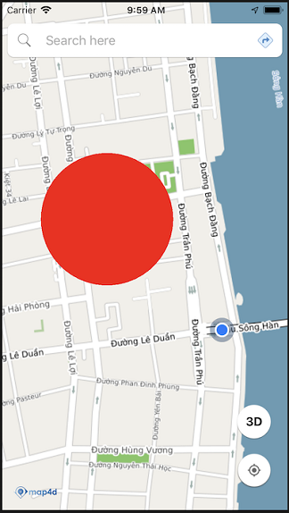
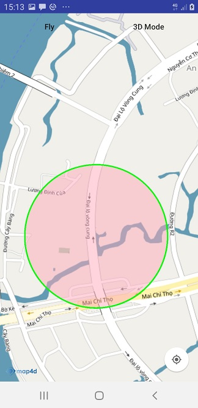

# Circle

Lớp Circle cho phép người dùng vẽ một Circle lên map..

### 1. Tạo circle



- Tạo circle from MFCircleOptions 

<!-- tabs:start -->
#### ** Kotlin **
```kotlin
 val circle = map4D.addCircle(MFCircleOptions()
                        .center(MFLocationCoordinate(16.066517, 108.210354))
                        .radius(500)
                        .fillColor(ContextCompat.getColor(this, R.color.redWithAlphaThirtyPercent)))
```
#### ** Java **
```java
 MFCircle circle = map4D.addCircle(new MFCircleOptions()
                        .center(new MFLocationCoordinate(16.066517, 108.210354))
                        .radius(500)
                        .fillColor(ContextCompat.getColor(this, R.color.redWithAlphaThirtyPercent)));
```
<!-- tabs:end -->

Như ví dụ trên thì chúng ta tạo một Circle với các tùy chỉnh như sau:
* Tâm của Circle ở tọa độ `MFLocationCoordinate (LatLng)`: 16.066517, 108.210354
* Bán kính của Circle là: 500 mét
* Màu của Circle là: #4D00ff00, 4D là giá trị alpha

- Tạo circle với strokeColor and strokeWidth.



<!-- tabs:start -->
#### ** Kotlin **
```kotlin
 val circle = map4D.addCircle(MFCircleOptions()
                        .center(MFLocationCoordinate(16.066517, 108.210354))
                        .radius(300.0)
                        .fillColor(ContextCompat.getColor(context ?: return, R.color.green))
                        .strokeWidth(5.0f)
                        .strokeColor(ContextCompat.getColor(this ?: return, R.color.red)))
```

#### ** Java **
```java
 java circle = map4D.addCircle(new MFCircleOptions()
                        .center(new MFLocationCoordinate(16.066517, 108.210354))
                        .radius(300)
                        .fillColor(ContextCompat.getColor(this, R.color.green))
                        .strokeWidth(5.f)
                        .strokeColor(ContextCompat.getColor(this, R.color.red)));
```

<!-- tabs:end -->
**Lưu ý:**

   - Stroke width đơn vị là point tương đương dp trong android
   - Stroke width mặc định là 0.f (không vẽ)
   
### 2. Xóa Circle

> Để xóa Circle ra khỏi bản đồ ta sử dụng hàm `remove()`

<!-- tabs:start -->
#### ** Kotlin **
```kotlin
 circle.remove()
```

#### ** Java **
```java
circle.remove();
```
<!-- tabs:end -->

### 3. Sự kiện click circle

Phát sinh khi người dùng click vào circle, mặc circle có thể click được (touchable).

<!-- tabs:start -->
#### ** Kotlin **
```kotlin
map4D?.setOnCircleClickListener { mfCircle ->
      Toast.makeText(context, "Circle clicked:  ${mfCircle.id}", Toast.LENGTH_SHORT).show()
    }
```
#### ** Java **
```java
map4D.setOnCircleClickListener(new Map4D.OnCircleClickListener() {
    @Override
    public void onCircleClick(MFCircle mfCircle) {
        Toast.makeText(getApplicationContext(), "Circle clicked:  " + mfCircle.getId(), Toast.LENGTH_SHORT).show();
    }
});
```
<!-- tabs:end -->

> Tham số mfCircle sẽ trả về đối tượng Circle mà người dùng click vào

## 4. Thứ tự vẽ các layer

- Giá trị default zIndex của Circle nếu người dùng không truyền vào là -1.f
- zIndex: Circle nào có zIndex lớn hơn sẽ ưu tiên hiển thị trước, zIndex càng lớn càng sẽ được vẽ sau.

<!-- tabs:start -->
#### ** Kotlin **
```kotlin
  val circleA = map4D.addCircle(MFCircleOptions()
                          .center(MFLocationCoordinate(16.066517, 108.210354))
                          .radius(500.0)
                          .fillColor(ContextCompat.getColor(context ?: return, R.color.green))
                          .zIndex(10.0f))
  val circleB = map4D.addCircle(MFCircleOptions()
                          .center(MFLocationCoordinate(16.066517, 108.210354))
                          .radius(500.0)
                          .fillColor(ContextCompat.getColor(context ?: return, R.color.red))
                          .zIndex(2.0f))
```

#### ** Java **
```java
  MFCircle circleA = map4D.addCircle(new MFCircleOptions()
                          .center(new MFLocationCoordinate(16.066517, 108.210354))
                          .radius(500)
                          .fillColor(ContextCompat.getColor(this, R.color.green))
                          .zIndex(10.f));
  MFCircle circleB = map4D.addCircle(new MFCircleOptions()
                          .center(new MFLocationCoordinate(16.066517, 108.210354))
                          .radius(500)
                          .fillColor(ContextCompat.getColor(this, R.color.red))
                          .zIndex(2.f));
```

<!-- tabs:end -->
- CircleA sẽ được vẽ đè lên vì zIndex của nó lớn hơn zIndex của circleB.

<!-- tabs:start -->

#### ** Kotlin **
```java
  MFCircle circleA = map4D.addCircle(new MFCircleOptions()
                            .center(new MFLocationCoordinate(16.066517, 108.210354))
                            .radius(500)
                            .fillColor(ContextCompat.getColor(this, R.color.red)));
  MFCircle circleB = map4D.addCircle(new MFCircleOptions()
                            .center(new MFLocationCoordinate(16.066517, 108.210354))
                            .radius(500)
                            .fillColor(ContextCompat.getColor(this, R.color.green)));
```
#### ** Java **
```java
  MFCircle circleA = map4D.addCircle(new MFCircleOptions()
                            .center(new MFLocationCoordinate(16.066517, 108.210354))
                            .radius(500)
                            .fillColor(ContextCompat.getColor(this, R.color.red)));
  MFCircle circleB = map4D.addCircle(new MFCircleOptions()
                            .center(new MFLocationCoordinate(16.066517, 108.210354))
                            .radius(500)
                            .fillColor(ContextCompat.getColor(this, R.color.green)));
```

<!-- tabs:end -->
- CircleB sẽ vẽ đè lên CircleA vì nó có zIndex bằng nhau. Cùng zIndex thì layer nào thêm vào sau sẽ vẽ đè lên layer trước.
