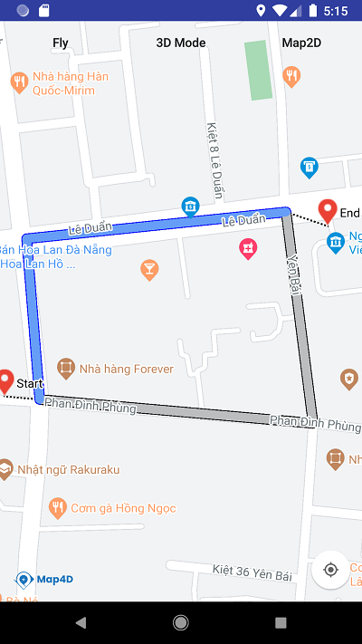

# Directions Renderer

Để vẽ chỉ đường giữa các địa điểm trên Map thì ta sử dụng đối tượng `Directions Renderer` thay cho việc vẽ nhiều `Polyline` một cách thủ công.

### 1. Tạo Directions Renderer



> Tạo đối tượng Directions Renderer từ **MFDirectionsRendererOptions**


<!-- tabs:start -->
#### ** Kotlin **
```kotlin
  val directionsRendererOptions = MFDirectionsRendererOptions()
  
  val paths: MutableList<List<MFLocationCoordinate>> = ArrayList()
  val path1: MutableList<MFLocationCoordinate> = ArrayList()
  path1.add(MFLocationCoordinate(16.070508, 108.221204))
  path1.add(MFLocationCoordinate(16.071449, 108.221124))
  path1.add(MFLocationCoordinate(16.071606, 108.222706))

  val path2: MutableList<MFLocationCoordinate> = ArrayList()
  path2.add(MFLocationCoordinate(16.070508, 108.221204))
  path2.add(MFLocationCoordinate(16.070369, 108.222870))
  path2.add(MFLocationCoordinate(16.071606, 108.222706))

  paths.add(path1)
  paths.add(path2)

  directionsRendererOptions.paths(paths)
  directionsRendererOptions.activeStrokeColor(resources.getColor(android.R.color.colorActiveStroke))
  directionsRendererOptions.inactiveStrokeColor(resources.getColor(android.R.color.colorInactiveStroke))
  directionsRendererOptions.activeOutlineColor(Color.BLUE)
  directionsRendererOptions.inactiveOutlineColor(Color.BLACK)
  directionsRendererOptions.width(10f)
  directionsRendererOptions.outlineWidth(2f)
  directionsRendererOptions.startLocation(MFLocationCoordinate(16.070526, 108.220990))
  directionsRendererOptions.startLabel("Start")
  directionsRendererOptions.endLocation(MFLocationCoordinate(16.071523, 108.222960))
  directionsRendererOptions.endLabel("End")
  val directionsRenderer = map4D?.addDirectionsRenderer(directionsRendererOptions)
```

#### ** Java **
```java
  MFDirectionsRendererOptions directionsRendererOptions = new MFDirectionsRendererOptions();
  
  List<List<MFLocationCoordinate>> paths = new ArrayList<>();
  List<MFLocationCoordinate> path1 = new ArrayList<>();
  path1.add(new MFLocationCoordinate(16.070508, 108.221204));
  path1.add(new MFLocationCoordinate(16.071449, 108.221124));
  path1.add(new MFLocationCoordinate(16.071606, 108.222706));

  List<MFLocationCoordinate> path2 = new ArrayList<>();
  path2.add(new MFLocationCoordinate(16.070508, 108.221204));
  path2.add(new MFLocationCoordinate(16.070369, 108.222870));
  path2.add(new MFLocationCoordinate(16.071606, 108.222706));

  paths.add(path1);
  paths.add(path2);

  directionsRendererOptions.paths(paths);
  directionsRendererOptions.activeStrokeColor(getResources().getColor(R.color.colorActiveStroke));
  directionsRendererOptions.inactiveStrokeColor(getResources().getColor(R.color.colorInactiveStroke));
  directionsRendererOptions.activeOutlineColor(Color.BLUE);
  directionsRendererOptions.inactiveOutlineColor(Color.BLACK);
  directionsRendererOptions.width(10.f);
  directionsRendererOptions.outlineWidth(2.f)
  directionsRendererOptions.startLocation(new MFLocationCoordinate(16.070526, 108.220990));
  directionsRendererOptions.startLabel("Start");
  directionsRendererOptions.endLocation(new MFLocationCoordinate(16.071523, 108.222960));
  directionsRendererOptions.endLabel("End");
  directionsRenderer = map4D.addDirectionsRenderer(directionsRendererOptions);
```
<!-- tabs:end -->

Ví dụ trên thì chúng ta tạo một directions Renderer từ 2 danh sách các tọa độ `path1` và `path2` tương ứng với 2 đường đi
với các tùy chỉnh cơ bản.


### 2. Xóa Directions Renderer

> Để xóa Directions Renderer ra khỏi bản đồ ta sử dụng hàm `remove()`

<!-- tabs:start -->
#### ** Kotlin **
```kotlin
  directionsRenderer.remove()
```
#### ** Java **
```java
  directionsRenderer.remove();
```
<!-- tabs:end -->

### 3. Sự kiện click Directions Renderer

- Phát sinh khi người dùng click lên đối tượng `Directions Renderer`

<!-- tabs:start -->

#### ** Kotlin **
```kotlin
    map4D?.setOnDirectionsClickListener { directionsRenderer, index ->
      Log.e("Events", "Click on directions renderer index: $index")
    }
```
#### ** Java **
```java
  map4D.setOnDirectionsClickListener(new Map4D.OnDirectionsClickListener() {
      @Override
      public void onDirectionsClick(MFDirectionsRenderer directionsRenderer, int index) {
          Log.e("Events", "Click on directions renderer index: " + index);
      }
  });
```
<!-- tabs:end -->
* Tham số directionsRenderer sẽ trả về đối tượng directionsRenderer mà người dùng click.
* Tham số index sẽ trả về chỉ số index của list các đường đi mà người dùng click lên.

