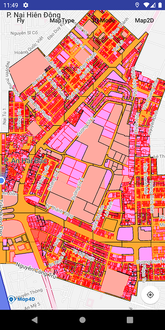

# GeoJson Layer

Map4D Android SDK cung cấp GeoJson layer cho phép người dùng hiển thị dữ liệu địa lý tùy ý, theo định dạng [GeoJSON](https://geojson.org/)



### 1. Thêm một GeoJSON layer

Để thêm một GeoJSON layer vào map, trước tiên cần tạo mới 1 đối tượng của lớp [MFGeoJsonOptions](/reference/geojson-layer?id=geojson-options) để
định nghĩa các thuộc tính ban đầu của lớp GeoJSON.
Sau đó ta gọi phương thức `addGeoJson` của lớp `Map4D`. Đối tượng trả về sau khi gọi phương thức `addGeoJson` là một [MFGeoJson](/reference/geojson-layer?id=geojson-class)

Ví dụ sau đây thêm một GeoJson layer vào bản đồ ở tọa độ `16.073420650938914, 108.22404093434358`

<!-- tabs:start -->
#### ** Kotlin **

```kotlin
override fun onMapReady(map4D: Map4D) {  
    val jsonString = """{
      "type": "FeatureCollection",
      "features": [
        {
          "type": "Feature",
          "properties": {
            "stroke": "#bf0808",
            "stroke-width": 2,
            "stroke-opacity": 1,
            "fill": "#45e8c7",
            "fill-opacity": 0.5
          },
          "geometry": {
            "coordinates": [
              [
                [
                  108.22404093434358,
                  16.073420650938914
                ],
                [
                  108.22404093434358,
                  16.07027546741118
                ],
                [
                  108.22708802596247,
                  16.07027546741118
                ],
                [
                  108.22708802596247,
                  16.073420650938914
                ],
                [
                  108.22404093434358,
                  16.073420650938914
                ]
              ]
            ],
            "type": "Polygon"
          }
        },
        {
          "type": "Feature",
          "properties": {
            "marker-color": "#bb00ff",
            "marker-size": "medium"
          },
          "geometry": {
            "coordinates": [
              108.22742287119428,
              16.07192448288062
            ],
            "type": "Point"
          }
        },
        {
          "type": "Feature",
          "properties": {
            "stroke": "#555555",
            "stroke-width": 5,
            "stroke-opacity": 1
          },
          "geometry": {
            "coordinates": [
              [
                108.22620905722562,
                16.072567997403468
              ],
              [
                108.22750658250317,
                16.074707668219588
              ],
              [
                108.22831858219348,
                16.07294606121482
              ],
              [
                108.23011000418842,
                16.073018456330914
              ],
              [
                108.22734753101753,
                16.069052773943497
              ]
            ],
            "type": "LineString"
          }
        }
      ]
    }"""

    try {
      val geoJsonOptions = MFGeoJsonOptions()
        .geoJson(JSONObject(jsonString))
        .pointStyle(MFGeoJsonPointStyle(MFBitmapDescriptorFactory.fromResource(R.drawable.default_marker)))
      val geoJson = map4D.addGeoJson(geoJsonOptions)
    } catch (e: Exception) {
      e.printStackTrace()
    }  
}
```
#### ** Java **

```java
@Override  
public void onMapReady(final Map4D map4D) {  
    String jsonString = "{\n" +
	  "  \"type\": \"FeatureCollection\",\n" +
	  "  \"features\": [\n" +
	  "    {\n" +
	  "      \"type\": \"Feature\",\n" +
	  "      \"properties\": {\n" +
	  "        \"stroke\": \"#bf0808\",\n" +
	  "        \"stroke-width\": 2,\n" +
	  "        \"stroke-opacity\": 1,\n" +
	  "        \"fill\": \"#45e8c7\",\n" +
	  "        \"fill-opacity\": 0.5\n" +
	  "      },\n" +
	  "      \"geometry\": {\n" +
	  "        \"coordinates\": [\n" +
	  "          [\n" +
	  "            [\n" +
	  "              108.22404093434358,\n" +
	  "              16.073420650938914\n" +
	  "            ],\n" +
	  "            [\n" +
	  "              108.22404093434358,\n" +
	  "              16.07027546741118\n" +
	  "            ],\n" +
	  "            [\n" +
	  "              108.22708802596247,\n" +
	  "              16.07027546741118\n" +
	  "            ],\n" +
	  "            [\n" +
	  "              108.22708802596247,\n" +
	  "              16.073420650938914\n" +
	  "            ],\n" +
	  "            [\n" +
	  "              108.22404093434358,\n" +
	  "              16.073420650938914\n" +
	  "            ]\n" +
	  "          ]\n" +
	  "        ],\n" +
	  "        \"type\": \"Polygon\"\n" +
	  "      }\n" +
	  "    },\n" +
	  "    {\n" +
	  "      \"type\": \"Feature\",\n" +
	  "      \"properties\": {\n" +
	  "        \"marker-color\": \"#bb00ff\",\n" +
	  "        \"marker-size\": \"medium\"\n" +
	  "      },\n" +
	  "      \"geometry\": {\n" +
	  "        \"coordinates\": [\n" +
	  "          108.22742287119428,\n" +
	  "          16.07192448288062\n" +
	  "        ],\n" +
	  "        \"type\": \"Point\"\n" +
	  "      }\n" +
	  "    },\n" +
	  "    {\n" +
	  "      \"type\": \"Feature\",\n" +
	  "      \"properties\": {\n" +
	  "        \"stroke\": \"#555555\",\n" +
	  "        \"stroke-width\": 5,\n" +
	  "        \"stroke-opacity\": 1\n" +
	  "      },\n" +
	  "      \"geometry\": {\n" +
	  "        \"coordinates\": [\n" +
	  "          [\n" +
	  "            108.22620905722562,\n" +
	  "            16.072567997403468\n" +
	  "          ],\n" +
	  "          [\n" +
	  "            108.22750658250317,\n" +
	  "            16.074707668219588\n" +
	  "          ],\n" +
	  "          [\n" +
	  "            108.22831858219348,\n" +
	  "            16.07294606121482\n" +
	  "          ],\n" +
	  "          [\n" +
	  "            108.23011000418842,\n" +
	  "            16.073018456330914\n" +
	  "          ],\n" +
	  "          [\n" +
	  "            108.22734753101753,\n" +
	  "            16.069052773943497\n" +
	  "          ]\n" +
	  "        ],\n" +
	  "        \"type\": \"LineString\"\n" +
	  "      }\n" +
	  "    }\n" +
	  "  ]\n" +
	  "}";
	try {
		MFGeoJsonOptions geoJsonOptions = new MFGeoJsonOptions()
		  .geoJson(new JSONObject(jsonString))
		  .pointStyle(new MFGeoJsonPointStyle(MFBitmapDescriptorFactory.fromResource(R.drawable.default_marker)));
		MFGeoJson geoJson = map4D.addGeoJson(geoJsonOptions);
	} catch (Exception e) {
		e.printStackTrace();
	}  
}
```
<!-- tabs:end -->

### 2. Xóa GeoJSON khỏi bản đồ

Để xóa một lớp GeoJSON khỏi bản đồ chúng ta gọi phương thức `remove`

<!-- tabs:start -->
#### ** Kotlin **

```kotlin
  geoJson?.remove()
```

#### ** Java **

```java
  geoJson.remove();
```
<!-- tabs:end -->

### 3. Thay đổi icon mặc định cho GeoJSON Point

Để thay đổi icon mặc định của GeoJSON Point thì ta tạo một đối tượng `MFGeoJsonPointStyle` với icon kiểu `MFBitmapDescriptor` sau đó truyền vào
option `pointStyle` của đối tượng `MFGeoJsonOptions` trước khi thêm GeoJSON layer vào bản đồ.

<!-- tabs:start -->
#### ** Kotlin **

```kotlin
  val geoJsonOptions = MFGeoJsonOptions()
    .pointStyle(MFGeoJsonPointStyle(MFBitmapDescriptorFactory.fromResource(R.drawable.default_marker)))
```
#### ** Java **

```java
  MFGeoJsonOptions geoJsonOptions = new MFGeoJsonOptions()
    .pointStyle(new MFGeoJsonPointStyle(MFBitmapDescriptorFactory.fromResource(R.drawable.default_marker)));
```
<!-- tabs:end -->

### 4. Sự kiện click GeoJSON layer

- Phát sinh khi người dùng click lên đối tượng `MFGeoJson`

<!-- tabs:start -->

#### ** Kotlin **
```kotlin
  map4D.setOnGeoJsonClickListener { geoJson, feature ->
    Log.e("Events", "GeoJson feature clicked: " + feature.id)
  }
```
#### ** Java **
```java
  map4D.setOnGeoJsonClickListener(new Map4D.OnGeoJsonClickListener() {
	@Override
	public void onGeoJsonClick(@NonNull MFGeoJson geoJson, @NonNull MFGeoJsonFeature feature) {
	  Log.e("Events", "GeoJson feature clicked: " + feature.getId());
	}
  });
```
<!-- tabs:end -->
* Tham số geoJson sẽ trả về đối tượng [MFGeoJson](/reference/geojson-layer?id=geojson-class) mà người dùng click.
* Tham số feature sẽ trả về đối tượng [MFGeoJsonFeature](/reference/geojson-layer?id=mfgeojsonfeature) của lớp GeoJson mà người dùng click lên.
