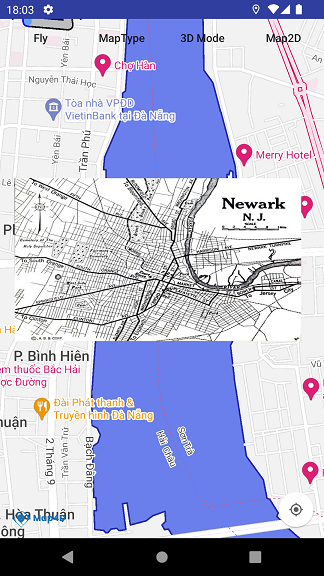

# Image Overlay

Image Overlay là một loại overlay cho phép hiển thị một hình ảnh có sẵn lên một vùng tọa độ xác định trên Map4D.



## Thêm Image Overlay

Để thêm 1 image overlay vào map cần tạo 1 đối tượng của lớp [MFImageOverlayOptions](reference/image-overlay?id=mfimageoverlayoptions-class) và set các options cần thiết
trên đối tượng đó. Sau đó gọi hàm `addImageOverlay` của lớp Map4D.

<!-- tabs:start -->
#### ** Java **

```java
private Map4D map4D;

MFImageOverlayOptions options = new MFImageOverlayOptions()
    .bounds(new MFCoordinateBounds(
        new MFLocationCoordinate(16.057814922971613, 108.22065353393553),
        new MFLocationCoordinate(16.064289641988594, 108.2324981689453)))
    .image(MFBitmapDescriptorFactory.fromResource(R.drawable.default_overlay))
    .visible(true)
    .zIndex(2)
    .opacity(0.5f);
MFImageOverlay imageOverlay = map4D.addImageOverlay(options);
```

#### ** Kotlin **

```kotlin
private lateinit var map4D: Map4D

val options = MFImageOverlayOptions()
    .bounds(
        MFCoordinateBounds(
            MFLocationCoordinate(16.057814922971613, 108.22065353393553),
            MFLocationCoordinate(16.064289641988594, 108.2324981689453)
        )
    )
    .image(MFBitmapDescriptorFactory.fromResource(R.drawable.default_overlay))
    .visible(true)
    .zIndex(2.0)
    .opacity(0.5f)
val imageOverlay = map4D.addImageOverlay(options)
```
<!-- tabs:end -->

### Xóa Image Overlay

Để xoá image overlay khỏi map, ta gọi phương thức `MFImageOverlay.remove()`

<!-- tabs:start -->
#### ** Java **

```java
imageOverlay.remove()
```

#### ** Kotlin **

```kotlin
imageOverlay.remove()
```
<!-- tabs:end -->

### Ẩn/Hiện Image Overlay

Gọi phương thức `MFImageOverlay.setVisible()` để ẩn/hiện Tile Overlay.

<!-- tabs:start -->
#### ** Java **

```java
imageOverlay.setVisible(false)
```

#### ** Kotlin **

```kotlin
imageOverlay.setVisible(false)
```
<!-- tabs:end -->

### Thay đổi độ trong suốt của Image Overlay

Để thay đổi độ trong suốt của hình ảnh, ta gọi phương thức `setOpacity(float)` cho đối tượng `MFImageOverlay`

Chú ý: opacity chỉ nhận giá trị trong khoảng 0 -> 1

<!-- tabs:start -->
#### ** Java **

```java
imageOverlay.setOpacity(0.5f)
```

#### ** Kotlin **

```kotlin
imageOverlay.opacity = 0.5f
```
<!-- tabs:end -->
