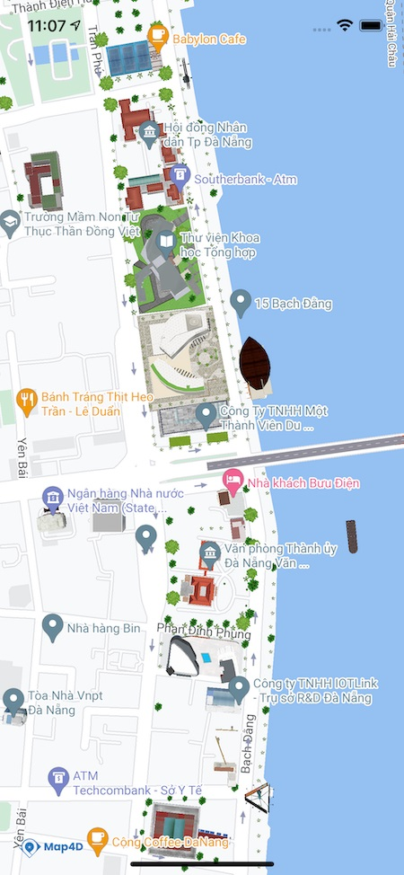
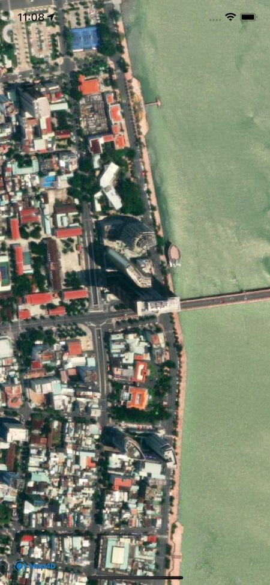
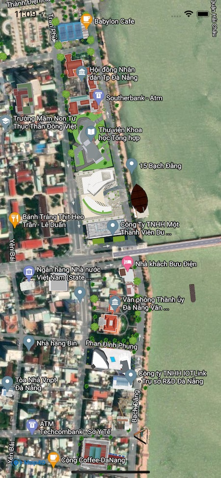

# Map Type

## Giới thiệu

> Map4dMap Android SDK cho phép tùy chỉnh kiểu hiển thị của Tile bản đồ theo nhiều chế độ (Raster, Roadmap, Satellite hoặc Map3D).

### Các loại bản đồ

Map4D Map SDK hiện cung cấp 4 loại bản đồ tùy chỉnh thông qua đối tượng `MFMapType` như bên dưới:

| No. | Name    | Description                                                                                                                                                            |
|:---:|---------|------------------------------------------------------------------------------------------------------------------------------------------------------------------------|
|  1  |ROADMAP  | Giá trị: `MFMapType.ROADMAP`<br>Các thành phần của bản đồ được vẽ dưới dạng các đường nét và hình khối, có độ phân giải cao<br>Đây là bản đồ mặc định của Map4dMap SDK |
|  3  |SATELLITE| Giá trị: `MFMapType.SATELLITE`<br>Các tiles của bản đồ được hiển thị dưới dạng hình ảnh vệ tinh.                                                                       |
|  3  |HYBRID   | Giá trị: `MFMapType.HYBRID`<br>Các tiles của bản đồ được hiển thị dưới dạng hình ảnh vệ tinh, kế hợp thông tin đường sá                                                |

|                 ROADMAP                                   | SATELLITE                                                    |                 HYBRID                                   |
|:---------------------------------------------------------:|:------------------------------------------------------------:|:--------------------------------------------------------:|
|  |  |  |


### Thay đổi kiểu bản đồ

Để thay kiểu bản đồ, ta gọi hàm `setMapType(MFMapType mapType)` thông qua đối tượng `Map4D`  
Ví dụ: để hiển thị bản đồ dạng Raster:

<!-- tabs:start -->
#### ** Java **

```java
private Map4D map4D;

map4D.setMapType(MFMapType.SATELLITE);
```

#### ** Kotlin **

```kotlin
private lateinit var map4D: Map4D

map4D.setMapType(MFMapType.SATELLITE)
```
<!-- tabs:end -->

### Get kiểu bản đồ hiện tại

Để get kiểu bản đồ hiện tại ta có thể gọi hàm `getMapType()` thông qua đối tượng `Map4D`. Giá trị trả về sẽ là một kiểu
của `MFMapType`

Ví dụ:

<!-- tabs:start -->
#### ** Java **

```java
private Map4D map4D;

MFMapType mapType = map4D.getMapType();
```

#### ** Kotlin **

```kotlin
private lateinit var map4D: Map4D

val mapType = map4D.getMapType()
```
<!-- tabs:end -->

