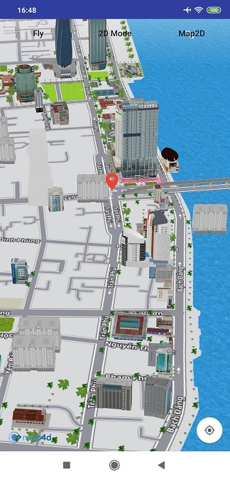

# POI

Hiện tại trên bản đồ đã có những điểm đánh dấu địa điểm có sẵn (như địa danh công cộng, quán cà phê, nhà hàng, bến xe, ...)
và chúng chỉ hiển thị khi bản đồ ở chế độ 2D. Khi bạn cần một đối tượng để đánh dấu một địa điểm trên bản đồ tương tự như
những điểm có sẵn đó thì bạn có thể dùng lớp **MFPOI**. Các đối tượng **MFPOI** bạn thêm vào bản đồ có thể hiển thị
ở **cả 2 chế độ 2D và 3D**. 

### 1. Tạo POI

 
  
<!-- tabs:start -->
#### ** Kotlin **
```kotlin
val userPOIOptions = MFPOIOptions()
    userPOIOptions.position(MFLocationCoordinate(16.066517, 108.210354)).title("Test User POI")
      .titleColor(Color.GREEN)
      .subtitle("Da Nang")
    val poi = map4D.addPOI(userPOIOptions)
```

#### ** Java **
```java
  MFPOIOptions userPOIOptions = new MFPOIOptions();
  userPOIOptions.position(new MFLocationCoordinate(16.071876, 108.223994)).title("Test User POI")
    titleColor(Color.GREEN).subtitle("Da Nang");
  MFPOI poi = map4D.addPOI(userPOIOptions);
```
<!-- tabs:end -->
 - **Chú ý**:
 - Người dùng có thể set icon cho POI bằng các cách sau (theo thứ tự ưu tiên):
   - ***Tuỳ biến lại marker bằng cách dùng hàm setIconView***
   - ***Sử dụng 1 hình ảnh làm icon dùng hàm setIcon***
   - ***Set type cho POI***
   
### 2. Xóa POI khỏi bản đồ

Để xóa một POI ra khỏi bản đồ, hãy gọi phương thức **remove()**

<!-- tabs:start -->
#### ** Kotlin **
```kotlin
    poi.remove()
```
#### ** Java **
```java
poi.remove();
```
<!-- tabs:end -->

### 3. Bật, tắt tính năng POI có sẵn của bản đồ

Bạn có thể bật hoặc tắt tính năng POI có sẵn của bản đồ. Mặc định thì bản đồ sẽ hiển thị các POI có sẵn của nó. Nếu bạn
muốn tắt nó đi thì sử dụng phương thức **setPOIsEnabled()** của lớp **Map4D** và truyền vào tham số **false**. Ngược
lại nếu bạn muốn bật nó lên thì bạn truyền vào tham số là **true**.

Ví dụ để tắt tính năng POI có sẵn của bản đồ:

<!-- tabs:start -->

#### ** Kotlin **
```kotlin
map4D?.setPOIsEnabled(false)
map4D?.isPOIsEnabled = false
```
#### ** Java **
```javascript
map4D.setPOIsEnabled(false);
```
<!-- tabs:end -->
Ngoài ra để kiểm tra tính năng POI có sẵn có được bật hay không bạn cũng có thể sử dụng phương thức **isPOIsEnabled()**
của lớp **Map4D**. Phương thức này sẽ trả về một giá trị **boolean** tương ứng với tính năng có được bật hay không.

<!-- tabs:start -->
#### ** Kotlin **
```kotlin
if (!map4D?.isPOIsEnabled) {
  Toast.makeText( context,
    "Poi is turn off",
    Toast.LENGTH_SHORT
  ).show()
}
```
#### ** Java **
```java
boolean isPOIsEnabled = map4D.isPOIsEnabled();
if (!isPOIsEnabled) {
  Toast.makeText( context,
    "Poi is turn off",
    Toast.LENGTH_SHORT
  ).show();
}
```
<!-- tabs:end -->

## 3. Sự kiện click POI

> Poi có 2 loại là của người dùng thêm vào và có sẵn trên bản đồ.

- Phát sinh khi người dùng click vào POI mà user thêm vào

<!-- tabs:start -->
#### ** Kotlin **
```kotlin
map4D?.setOnUserPOIClickListener {poi ->
    Toast.makeText(context, "User Poi Clicked: ${poi.title}", Toast.LENGTH_SHORT).show()
}
```

#### ** Java **
```java
map4D.setOnUserPOIClickListener(new Map4D.OnUserPOIClickListener() {
    @Override
    public void onUserPOIClick(MFPOI mfpoi) {
        Toast.makeText(context , "User Poi Clicked: " + mfpoi.getTitle(), Toast.LENGTH_SHORT).show();
    }
});
```
<!-- tabs:end -->

- Phát sinh khi người dùng click vào POI mà user thêm vào

<!-- tabs:start -->
#### ** Kotlin **
```kotlin
map4D?.setOnPOIClickListener { placeId, title, mfLocationCoordinate ->
    Toast.makeText(context, "Poi Clicked: $title", Toast.LENGTH_SHORT).show()
}
```

#### ** Java **
```java
map4D.setOnPOIClickListener(new Map4D.OnPOIClickListener() {
    @Override
    public void onPOIClick(String placeId, String title, MFLocationCoordinate location) {
        Toast.makeText(context , "Poi Clicked: " + title, Toast.LENGTH_SHORT).show();
    }
});
```
<!-- tabs:end -->
