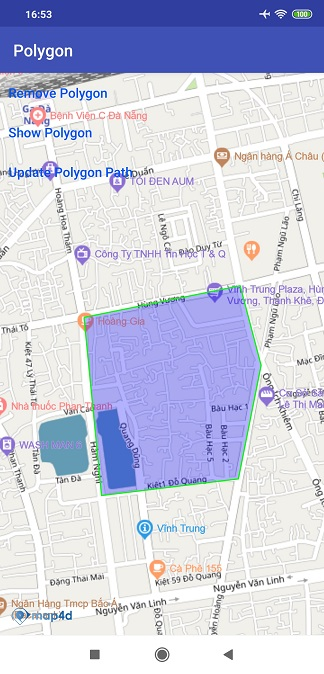
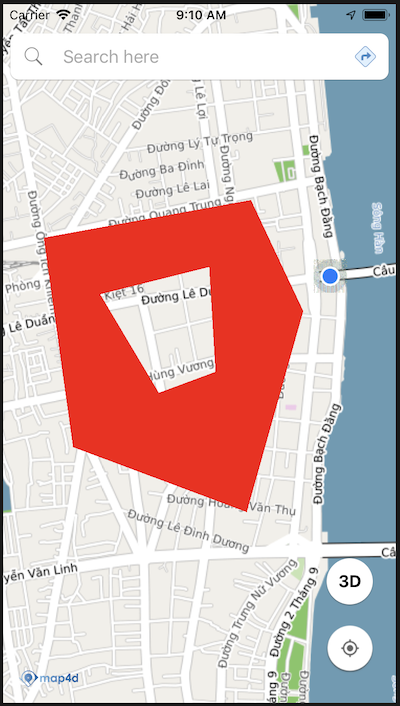

# Polygon

Lớp Polygon cho phép người dùng vẽ một Polygon lên map.

### 1. Tạo polygon



> Tạo đối tượng polygon từ MFPolygonOptions

<!-- tabs:start -->
#### ** Kotlin **
```kotlin
val pointsList = mutableListOf<MFLocationCoordinate>()

fun createPointsList() {
  pointsList.add(MFLocationCoordinate(16.066517, 108.210354))
  pointsList.add(MFLocationCoordinate(16.067243, 108.214077))
  pointsList.add(MFLocationCoordinate(16.065419, 108.214576))
  pointsList.add(MFLocationCoordinate(16.062815, 108.214034))
  pointsList.add(MFLocationCoordinate(16.062434, 108.210772))
  pointsList.add(MFLocationCoordinate(16.066517, 108.210354))
}

fun addPolygonToMap() {
  createPointsList();
  val polygon = map4D.addPolygon(
    MFPolygonOptions()
    .add(*pointsList.toTypedArray())
    .strokeColor(ContextCompat.getColor(context ?: return, R.color.green))
    .strokeWidth(2f)
      .zIndex(100f)
    .fillColor(ContextCompat.getColor(context ?: return, R.color.blueWithAlpha)))
}
addPolygonToMap()
```
#### ** Java **
```java
  private final List<MFLocationCoordinate> pointsList = new ArrayList<>();

  private void createPointsList() {
  	pointsList.add(new MFLocationCoordinate(16.066517, 108.210354));
  	pointsList.add(new MFLocationCoordinate(16.067243, 108.214077));
  	pointsList.add(new MFLocationCoordinate(16.065419, 108.214576));
  	pointsList.add(new MFLocationCoordinate(16.062815, 108.214034));
  	pointsList.add(new MFLocationCoordinate(16.062434, 108.210772));
  	pointsList.add(new MFLocationCoordinate(16.066517, 108.210354));
 }

  private void addPolygonToMap() {
	createPointsList();
	polygon = map4D.addPolygon(new MFPolygonOptions()
	        .add(pointsList.toArray(new MFLocationCoordinate[pointsList.size()]))
	        .strokeColor(ContextCompat.getColor(this, R.color.green))
            .strokeWidth(2)
	        .fillColor(ContextCompat.getColor(this, R.color.blueWithAlpha))));
	}
```
<!-- tabs:end -->
Như ví dụ trên thì chúng ta tạo một Polygon từ danh sách các điểm tọa độ trong danh sách `pointsList` . Các tùy chỉnh gồm:

* Màu cho polygon: 800000ff, giá trị alpha là 80(hex)

Ngoài ra chúng ta còn có thể tạo ra các Polygon có lỗ ở bên trong bằng cách thêm danh sách cái điểm tạo thành lỗ ở phía trong
polygon.



Ví dụ

<!-- tabs:start -->
#### ** Kotlin **

```kotlin
val pointsList = mutableListOf<MFLocationCoordinate>()
val holePath = mutableListOf<MFLocationCoordinate>()

fun createPointsList() {
  pointsList.add(MFLocationCoordinate(16.066517, 108.210354));
  pointsList.add(MFLocationCoordinate(16.067243, 108.214077));
  pointsList.add(MFLocationCoordinate(16.065419, 108.214576));
  pointsList.add(MFLocationCoordinate(16.062815, 108.214034));
  pointsList.add(MFLocationCoordinate(16.062434, 108.210772));
  pointsList.add(MFLocationCoordinate(16.066517, 108.210354));
}

fun createHole() {
  holePath.add(MFLocationCoordinate(16.065681, 108.211716));
  holePath.add(MFLocationCoordinate(16.065898, 108.213009));
  holePath.add(MFLocationCoordinate(16.065336, 108.213202));
  holePath.add(MFLocationCoordinate(16.064965, 108.212183));
  holePath.add(MFLocationCoordinate(16.065681, 108.211716));
}

fun addPolygonToMap() {
  createHole();
  createPointsList();
  val polygon = map4D.addPolygon(MFPolygonOptions()
    .add(*pointsList.toTypedArray())
    .addHole(*holePath.toTypedArray())
    .fillColor(ContextCompat.getColor(context ?: return, R.color.blueWithdAlphaFiftyPercent)))
}
addPolygonToMap()
```

#### ** Java **
```java
  private final List<MFLocationCoordinate> pointsList = new ArrayList<>();
  private final List<MFLocationCoordinate> holePath = new ArrayList<>();

  private void createPointsList() {
  	pointsList.add(new MFLocationCoordinate(16.066517, 108.210354));
  	pointsList.add(new MFLocationCoordinate(16.067243, 108.214077));
  	pointsList.add(new MFLocationCoordinate(16.065419, 108.214576));
  	pointsList.add(new MFLocationCoordinate(16.062815, 108.214034));
  	pointsList.add(new MFLocationCoordinate(16.062434, 108.210772));
  	pointsList.add(new MFLocationCoordinate(16.066517, 108.210354));
 }

  private void createHole() {
    holePath.add(new MFLocationCoordinate(16.065681, 108.211716));
    holePath.add(new MFLocationCoordinate(16.065898, 108.213009));
    holePath.add(new MFLocationCoordinate(16.065336, 108.213202));
    holePath.add(new MFLocationCoordinate(16.064965, 108.212183));
    holePath.add(new MFLocationCoordinate(16.065681, 108.211716));
  }

  private void addPolygonToMap() {
	createHole();
	createPointsList();
	polygon = map4D.addPolygon(new MFPolygonOptions()
	        .add(pointsList.toArray(new MFLocationCoordinate[pointsList.size()]))
	        .addHole(holePath.toArray(new MFLocationCoordinate[holePath.size()]))
	        .fillColor(ContextCompat.getColor(this, R.color.blueWithdAlphaFiftyPercent)));
  }
```

<!-- tabs:end -->

  ***Chú ý:***
> Điểm đầu điểm cuối danh sách các điểm cần vẽ phải giống nhau

  Xem demo ở ví dụ sau đây:

<!-- tabs:start -->
#### ** Kotlin **
```kotlin
    pointsList.add(MFLocationCoordinate(16.066517, 108.210354))
    pointsList.add(MFLocationCoordinate(16.067243, 108.214077))
    pointsList.add(MFLocationCoordinate(16.065419, 108.214576))
    pointsList.add(MFLocationCoordinate(16.062815, 108.214034))
    pointsList.add(MFLocationCoordinate(16.062434, 108.210772))
    pointsList.add(MFLocationCoordinate(16.066517, 108.210354))
```

#### ** Java **
```java
    pointsList.add(new MFLocationCoordinate(16.066517, 108.210354));
    pointsList.add(new MFLocationCoordinate(16.067243, 108.214077));
    pointsList.add(new MFLocationCoordinate(16.065419, 108.214576));
    pointsList.add(new MFLocationCoordinate(16.062815, 108.214034));
    pointsList.add(new MFLocationCoordinate(16.062434, 108.210772));
    pointsList.add(new MFLocationCoordinate(16.066517, 108.210354));
```
<!-- tabs:end -->

### 2. Xóa Polygon

> Để xóa Polygon ra khỏi bản đồ ta sử dụng hàm `remove()`

<!-- tabs:start -->
#### ** Kotlin **
```kotlin
  polygon.remove()
```
#### ** Java **
```java
  polygon.remove();
```
<!-- tabs:end -->

### 3. Sự kiện click polygon

Phát sinh khi người dùng click vào polygon

<!-- tabs:start -->
#### ** Kotlin **

```kotlin
map4D?.setOnPolygonClickListener {polygon ->
    Toast.makeText(context, "Clicked Polygon: ID: ${polygon.id}", Toast.LENGTH_SHORT).show()
}
```

#### ** Java **
```java
map4D.setOnPolygonClickListener(new Map4D.OnPolygonClickListener() {
    @Override
    public void onPolygonClick(MFPolygon polygon) {
        Toast.makeText(getApplicationContext(), "Clicked Polygon: ID " + polygon.getId(), Toast.LENGTH_SHORT).show();
    }
})
```
<!-- tabs:end -->

* Tham số polygon sẽ trả về đối tượng polygon mà người dùng click vào

### 4. Thứ tự vẽ các layer
- Giá trị default zIndex của Polygon nếu người dùng không truyền vào là -1.f
- zIndex: Polygon nào có zIndex lớn hơn sẽ ưu tiên hiển thị trước, zIndex càng lớn càng sẽ được vẽ sau.

<!-- tabs:start -->
#### ** Kotlin **
```kotlin
val pointsList   =  mutableListOf<MFLocationCoordinate>()

fun createPointsList() {
  pointsList.add(MFLocationCoordinate(16.066517, 108.210354))
  pointsList.add(MFLocationCoordinate(16.067243, 108.214077))
  pointsList.add(MFLocationCoordinate(16.065419, 108.214576))
  pointsList.add(MFLocationCoordinate(16.062815, 108.214034))
  pointsList.add(MFLocationCoordinate(16.062434, 108.210772))
  pointsList.add(MFLocationCoordinate(16.066517, 108.210354))
}

fun addPolygonToMap() {
  createPointsList()
  val polygonA = map4D.addPolygon(MFPolygonOptions()
    .add(*pointsList.toTypedArray())
    .fillColor(Color.RED)
    .zIndex(10f))

  val polygonB = map4D.addPolygon(MFPolygonOptions()
    .add(*pointsList.toTypedArray())
    .fillColor(Color.BLUE)
    .zIndex(2f))
}
addPolygonToMap()
```

#### ** Java **
```java
  private final List<MFLocationCoordinate> pointsList = new ArrayList<>();

  private void createPointsList() {
  	pointsList.add(new MFLocationCoordinate(16.066517, 108.210354));
  	pointsList.add(new MFLocationCoordinate(16.067243, 108.214077));
  	pointsList.add(new MFLocationCoordinate(16.065419, 108.214576));
  	pointsList.add(new MFLocationCoordinate(16.062815, 108.214034));
  	pointsList.add(new MFLocationCoordinate(16.062434, 108.210772));
  	pointsList.add(new MFLocationCoordinate(16.066517, 108.210354));
 }

  private void addPolygonToMap() {
	createPointsList();
	MFPolygon polygonA = map4D.addPolygon(new MFPolygonOptions()
	        .add(pointsList.toArray(new MFLocationCoordinate[pointsList.size()]))
	        .fillColor(ContextCompat.getColor(this, R.color.red))
	        .zIndex(10.f));

	MFPolygon polygonB = map4D.addPolygon(new MFPolygonOptions()
	        .add(pointsList.toArray(new MFLocationCoordinate[pointsList.size()]))
	        .fillColor(ContextCompat.getColor(this, R.color.blue))
	        .zIndex(2.f);
  }
```

<!-- tabs:end -->
- PolygonA sẽ được vẽ đè lên vì zIndex của nó lớn hơn zIndex của polygonB.

<!-- tabs:start -->
#### ** Kotlin **
```kotlin
val pointsList = mutableListOf<MFLocationCoordinate>()

fun createPointsList() {
  pointsList.add(MFLocationCoordinate(16.066517, 108.210354))
  pointsList.add(MFLocationCoordinate(16.067243, 108.214077))
  pointsList.add(MFLocationCoordinate(16.065419, 108.214576))
  pointsList.add(MFLocationCoordinate(16.062815, 108.214034))
  pointsList.add(MFLocationCoordinate(16.062434, 108.210772))
  pointsList.add(MFLocationCoordinate(16.066517, 108.210354))
}

fun addPolygonToMap() {
  createPointsList()
  val polygonA = map4D?.addPolygon(MFPolygonOptions()
    .add(*pointsList.toTypedArray())
    .fillColor(Color.RED))

  val polygonB = map4D?.addPolygon(MFPolygonOptions()
    .add(*pointsList.toTypedArray())
    .fillColor(Color.GREEN))
}
addPolygonToMap()
```
#### ** Java **
```java
  private final List<MFLocationCoordinate> pointsList = new ArrayList<>();

  private void createPointsList() {
  	pointsList.add(new MFLocationCoordinate(16.066517, 108.210354));
  	pointsList.add(new MFLocationCoordinate(16.067243, 108.214077));
  	pointsList.add(new MFLocationCoordinate(16.065419, 108.214576));
  	pointsList.add(new MFLocationCoordinate(16.062815, 108.214034));
  	pointsList.add(new MFLocationCoordinate(16.062434, 108.210772));
  	pointsList.add(new MFLocationCoordinate(16.066517, 108.210354));
 }

  private void addPolygonToMap() {
	createPointsList();
	MFPolygon polygonA = map4D.addPolygon(new MFPolygonOptions()
	        .add(pointsList.toArray(new MFLocationCoordinate[pointsList.size()]))
	        .fillColor(ContextCompat.getColor(this, R.color.red)));

	MFPolygon polygonB = map4D.addPolygon(new MFPolygonOptions()
	        .add(pointsList.toArray(new MFLocationCoordinate[pointsList.size()]))
	        .fillColor(ContextCompat.getColor(this, R.color.green)));
  }
```
<!-- tabs:end -->

- PolygonB sẽ vẽ đè lên polygonA vì nó có zIndex bằng nhau. Cùng zIndex thì layer nào thêm vào sau sẽ vẽ đè lên layer trước.
