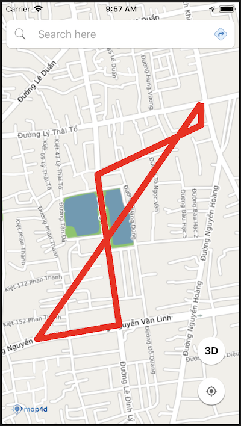
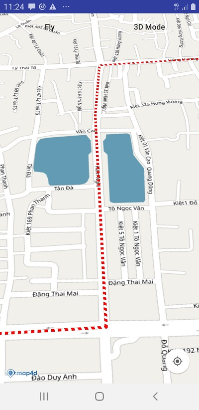
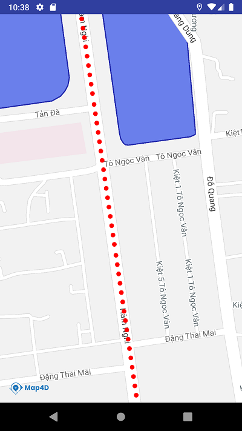
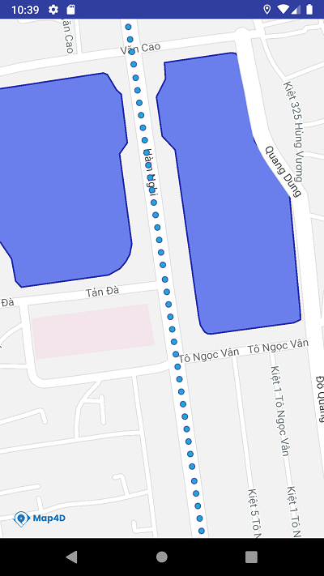

# Polyline

Để vẽ đường thẳng trên bản đồ thì ta sử dụng đối tượng Polyline. Một đối tượng Polyline bao gồm một mảng các điểm tọa độ
và tạo ra các đoạn thẳng nối các vị trí đó theo một trình tự có thứ tự.

### 1. Tạo polyline



> Tạo đối tượng polyline từ **MFPolylineOptions**


<!-- tabs:start -->
#### ** Kotlin **
```kotlin

  val latLngList = mutableListOf<MFLocationCoordinate>()
  latLngList.add(MFLocationCoordinate(16.067218, 108.213916))
  latLngList.add(MFLocationCoordinate(16.066496, 108.210311))
  latLngList.add(MFLocationCoordinate(16.064877, 108.210397))
  latLngList.add(MFLocationCoordinate(16.059980, 108.211137))
  latLngList.add(MFLocationCoordinate(16.059516, 108.208358))
  latLngList.add(MFLocationCoordinate(16.067218, 108.213916))
  val polyline = map4D?.addPolyline(
    MFPolylineOptions().add(*latLngList.toTypedArray())
    .color(ContextCompat.getColor(context ?: return, R.color.red))
    .width(8.0f))
```

#### ** Java **
```java
  private final List<MFLocationCoordinate> latLngList = new ArrayList<>();

  latLngList.add(new MFLocationCoordinate(16.067218, 108.213916));
  latLngList.add(new MFLocationCoordinate(16.066496, 108.210311));
  latLngList.add(new MFLocationCoordinate(16.064877, 108.210397));
  latLngList.add(new MFLocationCoordinate(16.059980, 108.211137));
  latLngList.add(new MFLocationCoordinate(16.059516, 108.208358));
  latLngList.add(new MFLocationCoordinate(16.067218, 108.213916));

  polyline = map4D.addPolyline(new MFPolylineOptions().add(latLngList.toArray(new MFLocationCoordinate[latLngList.size()]))
                .color(ContextCompat.getColor(this, R.color.red))
                .width(8);
```
<!-- tabs:end -->

Ví dụ trên thì chúng ta tạo một polyline từ danh sách các tọa độ `latLngList` với các tùy chỉnh:
* Màu sắc: là màu đỏ
* Độ rộng của polyline: 8 point

> Tạo Polyline với pattern. Pattern mặc định của Polyline là `MFSolidPattern`

Ví dụ bên dưới chúng ta sẽ sử dụng pattern `MFDashPattern` cho Polyline. Đó là các nét đứt nối tiếp nhau.

<!-- tabs:start -->
#### ** Kotlin **
```kotlin
  val latLngList: MutableList<MFLocationCoordinate> = mutableListOf()
  
  latLngList.add(MFLocationCoordinate(16.067218, 108.213916))
  latLngList.add(MFLocationCoordinate(16.066496, 108.210311))
  latLngList.add(MFLocationCoordinate(16.064877, 108.210397))
  latLngList.add(MFLocationCoordinate(16.059980, 108.211137))
  latLngList.add(MFLocationCoordinate(16.059516, 108.208358))

  val polyline = map4D!!.addPolyline(
    MFPolylineOptions().add(*latLngList.toTypedArray())
      .color(Color.RED)
      .width(8f)
      .pattern(MFDashPattern(8, 8))
```
#### ** Java **
```java
  final List<MFLocationCoordinate> latLngList = new ArrayList<>();

  latLngList.add(new MFLocationCoordinate(16.067218, 108.213916));
  latLngList.add(new MFLocationCoordinate(16.066496, 108.210311));
  latLngList.add(new MFLocationCoordinate(16.064877, 108.210397));
  latLngList.add(new MFLocationCoordinate(16.059980, 108.211137));
  latLngList.add(new MFLocationCoordinate(16.059516, 108.208358));

  polyline = map4D.addPolyline(new MFPolylineOptions().add(latLngList.toArray(new MFLocationCoordinate[latLngList.size()]))
                .color(Color.RED)
                .width(8)
                .pattern(new MFDashPattern(8, 8)));
```
<!-- tabs:end -->

- **Result**: 



Ngoài ra chúng ta còn có thêm pattern `MFDotPattern` và `MFIconPattern`

- Với `MFDotPattern` chúng ta sử dụng như sau:

<!-- tabs:start -->
#### ** Kotlin **
```kotlin
  val latLngList: MutableList<MFLocationCoordinate> = mutableListOf()
  
  latLngList.add(MFLocationCoordinate(16.067218, 108.213916))
  latLngList.add(MFLocationCoordinate(16.066496, 108.210311))
  latLngList.add(MFLocationCoordinate(16.064877, 108.210397))
  latLngList.add(MFLocationCoordinate(16.059980, 108.211137))
  latLngList.add(MFLocationCoordinate(16.059516, 108.208358))

  val polyline = map4D!!.addPolyline(
    MFPolylineOptions().add(*latLngList.toTypedArray())
      .color(Color.RED)
      .width(8f)
      .pattern(MFDotPattern(1))
```
#### ** Java **
```java
  final List<MFLocationCoordinate> latLngList = new ArrayList<>();

  latLngList.add(new MFLocationCoordinate(16.067218, 108.213916));
  latLngList.add(new MFLocationCoordinate(16.066496, 108.210311));
  latLngList.add(new MFLocationCoordinate(16.064877, 108.210397));
  latLngList.add(new MFLocationCoordinate(16.059980, 108.211137));
  latLngList.add(new MFLocationCoordinate(16.059516, 108.208358));

  polyline = map4D.addPolyline(new MFPolylineOptions().add(latLngList.toArray(new MFLocationCoordinate[latLngList.size()]))
                .color(Color.RED)
                .width(8)
                .pattern(new MFDotPattern(1)));
```
<!-- tabs:end -->

- **Result**



- Với `MFIconPattern` chúng ta sử dụng như sau:

<!-- tabs:start -->
#### ** Kotlin **
```kotlin
  val latLngList: MutableList<MFLocationCoordinate> = mutableListOf()
  
  latLngList.add(MFLocationCoordinate(16.067218, 108.213916))
  latLngList.add(MFLocationCoordinate(16.066496, 108.210311))
  latLngList.add(MFLocationCoordinate(16.064877, 108.210397))
  latLngList.add(MFLocationCoordinate(16.059980, 108.211137))
  latLngList.add(MFLocationCoordinate(16.059516, 108.208358))
  
  // icon có hỗ trợ alpha để tạo các khoảng hở cho hình ảnh
  val icon = MFBitmapDescriptorFactory.fromResource(R.drawable.your_icon)

  val polyline = map4D!!.addPolyline(
    MFPolylineOptions().add(*latLngList.toTypedArray())
      .color(Color.RED)
      .width(8f)
      .pattern(MFIconPattern(icon))
```
#### ** Java **
```java
  final List<MFLocationCoordinate> latLngList = new ArrayList<>();

  latLngList.add(new MFLocationCoordinate(16.067218, 108.213916));
  latLngList.add(new MFLocationCoordinate(16.066496, 108.210311));
  latLngList.add(new MFLocationCoordinate(16.064877, 108.210397));
  latLngList.add(new MFLocationCoordinate(16.059980, 108.211137));
  latLngList.add(new MFLocationCoordinate(16.059516, 108.208358));
  
  // icon có hỗ trợ alpha để tạo các khoảng hở cho hình ảnh
  MFBitmapDescriptor icon = MFBitmapDescriptorFactory.fromResource(R.drawable.your_icon);

  polyline = map4D.addPolyline(new MFPolylineOptions().add(latLngList.toArray(new MFLocationCoordinate[latLngList.size()]))
                .color(Color.RED)
                .width(8)
                .pattern(new MFIconPattern(icon)));
```
<!-- tabs:end -->

- **Result**



### 2. Xóa Polyline

> Để xóa polyline ra khỏi bản đồ ta sử dụng hàm `remove()`

<!-- tabs:start -->
#### ** Kotlin **
```kotlin
  polyline.remove()
```
#### ** Java **
```java
  polyline.remove();
```
<!-- tabs:end -->

### 3. Sự kiện click polyline

- Phát sinh khi người dùng click vào polyline

<!-- tabs:start -->

#### ** Kotlin **
```kotlin
    map4D?.setOnPolylineClickListener{ polyline ->
        Toast.makeText( context ?: return@setOnPolylineClickListener,
          "clicked Polyline: id " + polyline.id,
          Toast.LENGTH_SHORT
        ).show()
    }
```
#### ** Java **
```java
  map4D.setOnPolylineClickListener(new Map4D.OnPolylineClickListener() {
    @Override
    public void onPolylineClick(MFPolyline polyline) {
        Toast.makeText(getApplicationContext(), "clicked Polyline: id " + polyline.getId(), Toast.LENGTH_SHORT).show();
    }
  });
```
<!-- tabs:end -->
* Tham số polyline sẽ trả về đối tượng polyline mà người dùng click vào

## 4. Thứ tự vẽ các layer

- Giá trị default zIndex của Polyline nếu người dùng không truyền vào là -1.f
- zIndex: Polyline nào có zIndex lớn hơn sẽ ưu tiên hiển thị trước, zIndex càng lớn càng sẽ được vẽ sau.

<!-- tabs:start -->
#### ** Kotlin **
```kotlin
	val latLngList: MutableList<MFLocationCoordinate> = ArrayList()
    latLngList.add(MFLocationCoordinate(16.067218, 108.213916))
    latLngList.add(MFLocationCoordinate(16.066496, 108.210311))
    latLngList.add(MFLocationCoordinate(16.064877, 108.210397))
    latLngList.add(MFLocationCoordinate(16.059980, 108.211137))
    latLngList.add(MFLocationCoordinate(16.059516, 108.208358))

    val polylineA = map4D!!.addPolyline(
      MFPolylineOptions().add(*latLngList.toTypedArray())
        .color(Color.BLUE)
        .width(20f)
        .zIndex(5f)
    )

    val polylineB = map4D!!.addPolyline(
      MFPolylineOptions().add(*latLngList.toTypedArray())
        .color(Color.RED)
        .width(8f)
        .zIndex(10f)
    )
```
#### ** Java **
```java
	final List<MFLocationCoordinate> latLngList = new ArrayList<>();
    latLngList.add(new MFLocationCoordinate(16.067218, 108.213916));
    latLngList.add(new MFLocationCoordinate(16.066496, 108.210311));
    latLngList.add(new MFLocationCoordinate(16.064877, 108.210397));
    latLngList.add(new MFLocationCoordinate(16.059980, 108.211137));
    latLngList.add(new MFLocationCoordinate(16.059516, 108.208358));
    
    MFPolylineA polylineA = map4D.addPolyline(new MFPolylineOptions().add(latLngList.toArray(new MFLocationCoordinate[latLngList.size()]))
                    .color(ContextCompat.getColor(this, R.color.blue))
                    .width(20.f)
                    .zIndex(5.f));
                    
    MFPolyline polylineB = map4D.addPolyline(new MFPolylineOptions().add(latLngList.toArray(new MFLocationCoordinate[latLngList.size()]))
                    .color(ContextCompat.getColor(this, R.color.blue))
                    .width(8.f)
                    .zindex(10.f));
```
<!-- tabs:end -->
Như ví dụ ở trên thì polylineB sẽ đè lên polylineA vì nó có zIndex lớn hơn zIndex của polylineA.

- zIndex bằng nhau thì add vào sau sẽ vẽ sau.

**Ví dụ:**

<!-- tabs:start -->
#### ** Kotlin **
```kotlin
val latLngList: MutableList<MFLocationCoordinate> = ArrayList()
    latLngList.add(MFLocationCoordinate(16.067218, 108.213916))
    latLngList.add(MFLocationCoordinate(16.066496, 108.210311))
    latLngList.add(MFLocationCoordinate(16.064877, 108.210397))
    latLngList.add(MFLocationCoordinate(16.059980, 108.211137))
    latLngList.add(MFLocationCoordinate(16.059516, 108.208358))

    val polylineA = map4D!!.addPolyline(
      MFPolylineOptions().add(*latLngList.toTypedArray())
        .color(Color.BLUE)
        .width(8f)
        .zIndex(5f)
    )

    val polylineB = map4D!!.addPolyline(
      MFPolylineOptions().add(*latLngList.toTypedArray())
        .color(Color.RED)
        .width(20f)
        .zIndex(5f)
    )
```

#### ** Java **
```java
	final List<MFLocationCoordinate> latLngList = new ArrayList<>();
    latLngList.add(new MFLocationCoordinate(16.067218, 108.213916));
    latLngList.add(new MFLocationCoordinate(16.066496, 108.210311));
    latLngList.add(new MFLocationCoordinate(16.064877, 108.210397));
    latLngList.add(new MFLocationCoordinate(16.059980, 108.211137));
    latLngList.add(new MFLocationCoordinate(16.059516, 108.208358));
    
    MFPolylineA polylineA = map4D.addPolyline(new MFPolylineOptions().add(latLngList.toArray(new MFLocationCoordinate[latLngList.size()]))
                    .color(ContextCompat.getColor(this, R.color.blueWithAlpha))
                    .width(8.f)
                    .zIndex(5.f));
                    
    MFPolyline polylineB = map4D.addPolyline(new MFPolylineOptions().add(latLngList.toArray(new MFLocationCoordinate[latLngList.size()]))
                    .color(ContextCompat.getColor(this, R.color.blueWithAlpha))
                    .width(20.f)
                    .zindex(5.f));
```
<!-- tabs:end -->

Như ví dụ ở trên thì polylineB sẽ đè lên polylineA vì nó có zIndex bằng nhau nên được add vào sau sẽ được vẽ sau.
