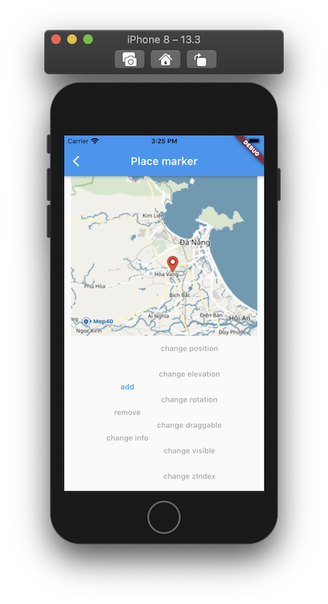

# Marker

> **Marker** dùng để xác định một vị trí trên bản đồ, cho phép người dùng thêm một điểm ghim ở một vị trí xác định.

 

## MFMarker

### Constructors

```dart
const MFMarker({
  required this.markerId,
  this.consumeTapEvents = false,
  this.position = const MFLatLng(0.0, 0.0),
  this.elevation = 0.0,
  this.rotation = 0.0,
  this.anchor = const Offset(0.5, 0.5),
  this.draggable = false,
  this.visible = true,
  this.zIndex = 0.0,
  this.icon = MFBitmap.defaultIcon,
  this.infoWindow = MFInfoWindow.noText,
  this.onTap,
  this.onDragEnd,
});
```

### Properties

| Name             | Type                                                                                     | Description                                           |
|------------------|------------------------------------------------------------------------------------------|-------------------------------------------------------|
| markerId         | [MFMarkerId](//pub.dev/documentation/map4d_map/latest/map4d_map/MFMarkerId-class.html)   | Id của Marker.                                        |
| consumeTapEvents | `bool` | Default: `false`. Cho phép người dùng có thể tương tác được với Marker hay không. Nếu `false` thì `onTap` callback sẽ không được gọi.   |
| position         | [MFLatLng](//pub.dev/documentation/map4d_map/latest/map4d_map/MFLatLng-class.html)       | Vị trí của Marker trên bản đồ                         |
| elevation        | `double`                                                        | Default: `0`. Chỉ định độ cao của Marker so với mực nước biển, đơn vị là mét.  |
| rotation         | `double`                                                        | Default: `0`. Chỉ định góc quay của Marker theo *(đơn vị: độ)*.                |
| anchor           | [Offset](//api.flutter.dev/flutter/dart-ui/Offset-class.html)   | Default: `(0.5, 0.5)`. Xác định điểm neo cho Marker.                           |
| draggable        | `bool`                                                          | Default: `false`. Cho phép người dùng có thể kéo Marker trên bản đồ hay không. |
| visible          | `bool`                                                          | Default: `true`. Ẩn hay hiện marker trên bản đồ.                               |
| zIndex           | `double`                                                        | Default: `0`. Chỉ định thứ tự hiển thị giữa marker với các đối tượng khác trên bản đồ. |
| icon             | [MFBitmap](//pub.dev/documentation/map4d_map/latest/map4d_map/MFBitmap-class.html)         | Tùy chỉnh icon cho Marker.                          |
| infoWindow       | [MFInfoWindow](//pub.dev/documentation/map4d_map/latest/map4d_map/MFInfoWindow-class.html) | Tùy chỉnh thông tin hiển thị khi  người dùng tap vào marker. |
| onTap            | [VoidCallback](https://api.flutter.dev/flutter/dart-ui/VoidCallback.html)                  | Callback được gọi khi người dùng tap vào marker.    |
| onDragEnd        | ValueChanged<MFLatLng>                                          | Callback được gọi khi người dùng kết thúc việc kéo marker trên bản đồ.         |

## MFInfoWindow

### Constructors

```dart
const MFInfoWindow({
  this.title,
  this.snippet,
  this.anchor = const Offset(0.5, 0.0),
  this.onTap,
});
```

### Properties

| Name    | Type                                                          | Description                                                                  |
|---------|---------------------------------------------------------------|------------------------------------------------------------------------------|
| title   | `String`                                                      | Tiêu đề thông tin marker                                                     |
| snippet | `String`                                                      | Mô tả thông tin ngắn gọn cho marker.                                         |
| anchor  | [Offset](//api.flutter.dev/flutter/dart-ui/Offset-class.html) | Default: `(0.5, 0.5)`.. Xác định điểm neo bảng thông tin của marker.         |
| onTap   | [VoidCallback](https://api.flutter.dev/flutter/dart-ui/VoidCallback.html) | Callback được gọi khi người dùng tap vào info window của marker. |

## Notes

### Custom icon cho marker

Map4dMap Flutter SDKs cung cấp class [MFBitmap](//) để thuận tiện cho việc thay đổi icon của marker bằng hình ảnh sẵn có.  
Để tạo được đối tượng `MFBitmap` chính xác cần gọi phương thức [MFBitmap.fromAssetImage](//pub.dev/documentation/map4d_map/latest/map4d_map/MFBitmap/fromAssetImage.html) với 2 tham số quan trọng là:
- configuration: [ImageConfiguration](//api.flutter.dev/flutter/painting/ImageConfiguration-class.html)
- assetName: String

!> Trong đó: `configuration` cần phải được tạo từ phương thức [createLocalImageConfiguration](//api.flutter.dev/flutter/widgets/createLocalImageConfiguration.html) để có thể nhận diện được chính xác hình ảnh từ context của ứng dụng.  
Nếu không tạo bằng phương thức này, custom icon có thể sẽ không hiển thị chính xác.

## Example

Ví dụ tương tác với marker có thể xem tại:

<https://github.com/map4d/map4d-map-flutter/blob/master/example/lib/place_marker.dart>
