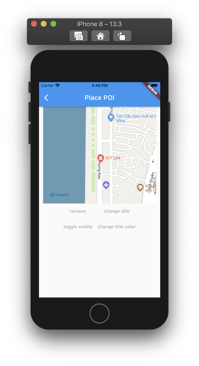

# POI

> Hiện tại trên bản đồ đã có những điểm đánh dấu địa điểm có sẵn (như địa danh công cộng, quán cà phê, nhà hàng, bến xe, ...)
và chúng chỉ hiển thị khi bản đồ ở chế độ 2D. Khi bạn cần một đối tượng để đánh dấu một địa điểm trên bản đồ tương tự như
những điểm có sẵn đó thì bạn có thể dùng lớp [MFPOI](//pub.dev/documentation/map4d_map/latest/map4d_map/MFPOI-class.html).  
Các đối tượng POI bạn thêm vào bản đồ có thể hiện thị
ở cả 2 chế độ 2D và 3D.

 

## MFPOI

### Constructors

```dart
const MFPOI({
  required this.poiId,
  this.consumeTapEvents = false,
  this.position = const MFLatLng(0.0, 0.0),
  this.title = '',
  this.titleColor = Colors.blue,
  this.icon = MFBitmap.defaultIcon,
  this.type = 'point',
  this.visible = true,
  this.zIndex = 0,
  this.onTap
});
```

### Properties

| Name             | Type                                                                                     | Description                                           |
|------------------|------------------------------------------------------------------------------------------|-------------------------------------------------------|
| poiId            | [MFPOIId](//pub.dev/documentation/map4d_map/latest/map4d_map/MFPOIId-class.html)         | Id của POI.                                           |
| consumeTapEvents | `bool` | Default: `false`. Cho phép người dùng có thể tương tác được với POI hay không. Nếu `false` thì `onTap` callback sẽ không được gọi.      |
| position         | [MFLatLng](//pub.dev/documentation/map4d_map/latest/map4d_map/MFLatLng-class.html)       | Vị trí của POI trên bản đồ                            |
| title            | `String`       | Chỉ định tiêu đề của POI. Tiêu đề sẽ hiển thị thông tin của POI mà bạn muốn hiển thị cho người dùng.                            |
| titleColor       | [Color](https://api.flutter.dev/flutter/dart-ui/Color-class.html)                        | Chỉ định màu tiêu đề của POI.                         |
| icon             | [MFBitmap](//pub.dev/documentation/map4d_map/latest/map4d_map/MFBitmap-class.html)       | Tùy chỉnh icon cho POI.                               |
| type             | `String`       | Default: `point`. Chỉ định kiểu của POI, tùy thuộc vào kiểu mà icon của POI sẽ có hình ảnh tương ứng. E.g: atm, park, cafe, ... |
| visible          | `bool`                                                     | Default: `true`. Ẩn hay hiện POI trên bản đồ.                                       |
| zIndex           | `int`                                                      | Default: `0`. Chỉ định thứ tự hiển thị giữa POI với các đối tượng khác trên bản đồ. |
| onTap            | [VoidCallback](https://api.flutter.dev/flutter/dart-ui/VoidCallback.html)                | Callback được gọi khi người dùng tap vào POI.         |

## Notes

### Type của POI

Type của POI tương ứng với các type của base map poi hiển thị trên bản đồ. Tùy vào từng type sẽ có icon hiển thị tương ứng với type của base map với màu sắc nổi bật hơn.  

Hiện tại Map4D hỗ trợ cái kiểu sau: point, cafe, bus_station, electronics, shop, bakery, fuel, restaurant, police, payment_centre, museum, university, school, airport, bank, clothes, motel, insurance, furniture, atm, hospital, bar, books, theatre, car, goverment, townhall, apartment, park, stadium, nightclub.

### Custom icon cho POI

Map4dMap Flutter SDKs cung cấp class [MFBitmap](//) để thuận tiện cho việc thay đổi icon của POI bằng hình ảnh sẵn có.  
Để tạo được đối tượng `MFBitmap` chính xác cần gọi phương thức [MFBitmap.fromAssetImage](//pub.dev/documentation/map4d_map/latest/map4d_map/MFBitmap/fromAssetImage.html) với 2 tham số quan trọng là:
- configuration: [ImageConfiguration](//api.flutter.dev/flutter/painting/ImageConfiguration-class.html)
- assetName: String

!> Trong đó: `configuration` cần phải được tạo từ phương thức [createLocalImageConfiguration](//api.flutter.dev/flutter/widgets/createLocalImageConfiguration.html) để có thể nhận diện được chính xác hình ảnh từ context của ứng dụng.  
Nếu không tạo bằng phương thức này, custom icon có thể sẽ không hiển thị chính xác.

### Type và Icon

!> Trong trường hợp cả type và icon đều được gán giá trị thì Map4dMap SDKs sẽ ưu tiên hiển thị hình ảnh của POI từ tham số `icon`.

## Example

Ví dụ tương tác với poi có thể xem tại:

<https://github.com/map4d/map4d-map-flutter/blob/master/example/lib/place_poi.dart>
