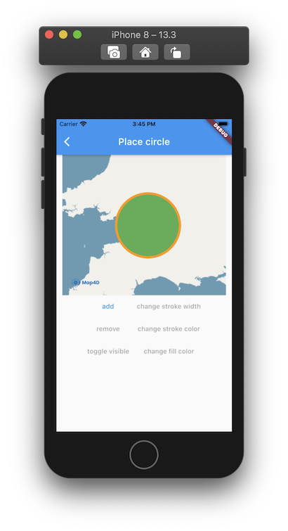

# Circle

> Map4D SDK cung cấp cho bạn lớp **MFCircle** để vẽ một hình tròn lên bản đồ.  

 

## MFCircle

### Constructors

```dart
const MFCircle({
  required this.circleId,
  this.consumeTapEvents = false,
  this.fillColor = Colors.transparent,
  this.center = const MFLatLng(0.0, 0.0),
  this.radius = 0,
  this.strokeColor = Colors.black,
  this.strokeWidth = 10,
  this.visible = true,
  this.zIndex = 0,
  this.onTap,
});
```

### Properties

| Name             | Type                                                                                     | Description                                           |
|------------------|------------------------------------------------------------------------------------------|-------------------------------------------------------|
| circleId         | [MFCircleId](//pub.dev/documentation/map4d_map/latest/map4d_map/MFCircleId-class.html)   | Id của Circle.                                        |
| consumeTapEvents | `bool` | Default: `false`. Cho phép người dùng có thể tương tác được với Circle hay không. Nếu `false` thì `onTap` callback sẽ không được gọi.   |
| fillColor        | [Color](https://api.flutter.dev/flutter/dart-ui/Color-class.html)                        | Chỉ định màu sắc của Circle.                          |
| center           | [MFLatLng](//pub.dev/documentation/map4d_map/latest/map4d_map/MFLatLng-class.html)       | Chỉ định vị trí của Circle trên bản đồ                |
| radius           | `double`                                                                                 | Bán kính đường của tròn tính từ tâm.                  |
| strokeColor      | [Color](https://api.flutter.dev/flutter/dart-ui/Color-class.html)                        | Chỉ định màu sắc đường viền của Circle.               |
| strokeWidth      | `int`                                                                                    | Chỉ định độ lớn đường viền của Circle.                |
| visible          | `bool`                                                                                   | Xác định Circle có thể ẩn hay hiện trên bản đồ.       |
| zIndex           | `int`                                   | Chỉ định thứ tự hiển thị giữa các Circle với nhau hoặc giữa Circle với các đối tượng khác trên bản đồ. |
| onTap            | [VoidCallback](https://api.flutter.dev/flutter/dart-ui/VoidCallback.html)                | Callback được gọi khi người dùng tap vào Circle.      |

## Example

Ví dụ tương tác với circle có thể xem tại:

<https://github.com/map4d/map4d-map-flutter/blob/master/example/lib/place_circle.dart>
