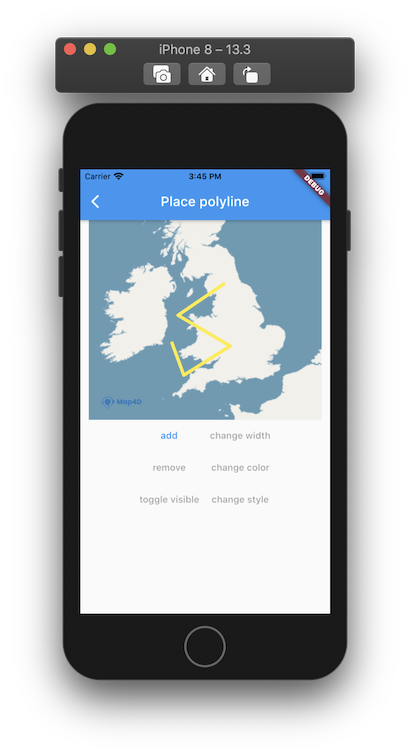

# Polyline

> Để vẽ các đường thẳng trên bản đồ thì ta sử dụng đối tượng [MFPolyline](//pub.dev/documentation/map4d_map/latest/map4d_map/MFPolyline-class.html).  
Một đối tượng **MFPolyline** bao gồm một mảng các điểm tọa độ và tạo ra các đoạn thẳng nối các vị trí đó theo một trình tự có thứ tự.

 

## MFPolyline

### Constructors

```dart
const MFPolyline({
  required this.polylineId,
  this.consumeTapEvents = false,
  this.color = Colors.black,
  this.style = MFPolylineStyle.solid,
  this.points = const <MFLatLng>[],
  this.visible = true,
  this.width = 10,
  this.zIndex = 0,
  this.onTap,
});
```

### Properties

| Name             | Type                                                                                       | Description                                           |
|------------------|--------------------------------------------------------------------------------------------|-------------------------------------------------------|
| polylineId       | [MFPolylineId](//pub.dev/documentation/map4d_map/latest/map4d_map/MFPolylineId-class.html) | Id của polyline                                       |
| consumeTapEvents | `bool` | Default: `false`. Cho phép người dùng có thể tương tác được với Polyline hay không. Nếu `false` thì `onTap` callback sẽ không được gọi.   |
| color            | [Color](https://api.flutter.dev/flutter/dart-ui/Color-class.html)                          | Chỉ định màu sắc của polyline.                        |
| style | [MFPolylineStyle](//pub.dev/documentation/map4d_map/latest/map4d_map/MFPolylineStyle-class.html) | Default: `solid`. Nét vẽ cho polyline (solid hoặc dotted). |
| points           | [List\<MFLatLng\>](https://pub.dev/documentation/map4d_map/latest/map4d_map/MFLatLng-class.html) | Mảng các tọa độ để tạo polyline.                |
| visible          | `bool`                                                                                     | Default: `true`. Ẩn hay hiện polyline trên bản đồ.    |
| width            | `int`                                                                                      | Chỉ định độ rộng của polyline theo đơn vị point.      |
| zIndex           | `int`                                              | Default: `0`.. Chỉ định thứ tự hiển thị giữa các polyline với các đối tượng khác trên bản đồ. |
| onTap            | [VoidCallback](https://api.flutter.dev/flutter/dart-ui/VoidCallback.html)                  | Callback được gọi khi người dùng tap vào polyline.    |

## Example

Ví dụ tương tác với polyline có thể xem tại:

<https://github.com/map4d/map4d-map-flutter/blob/master/example/lib/place_polyline.dart>
