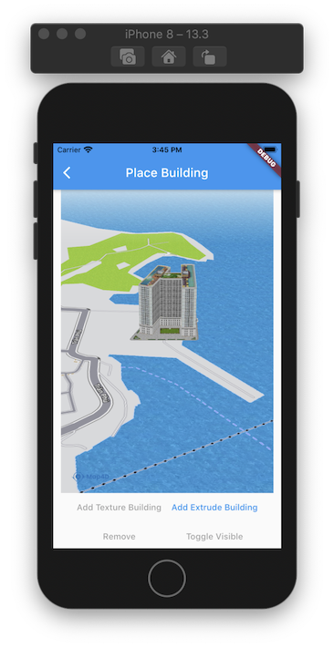

# Building

> Điểm khác biệt giữa nền tảng bản đồ Map4D với các nền tảng bản đồ khác đó là chế độ bản đồ 3D.  
Chế độ này sẽ có các đối tượng 3D mô phỏng lại các tòa nhà, cây cối, các cây cầu cũng như các công trình kiến trúc khác, ...  
Ngoài những đối tượng building 3D  có sẵn của bản đồ, bạn còn có thể tự tạo và thêm đối tượng 3D của bạn lên bản đồ thông qua đối tượng [MFBuilding](//pub.dev/documentation/map4d_map/latest/map4d_map/MFBuilding-class.html)

 

## MFBuilding

### Constructors

```dart
const MFBuilding({
  required this.buildingId,
  this.consumeTapEvents = false,
  this.name = '',
  this.position = const MFLatLng(0, 0),
  this.coordinates = const <MFLatLng>[],
  this.modelUrl = '',
  this.textureUrl = '',
  this.height = 1,
  this.scale = 1,
  this.bearing = 0,
  this.elevation = 0,
  this.selected = false,
  this.visible = true,
  this.onTap
});
```

### Properties

| Name             | Type                                                                                             | Description                                         |
|------------------|--------------------------------------------------------------------------------------------------|-----------------------------------------------------|
| buildingId       | [MFBuildingId](//pub.dev/documentation/map4d_map/latest/map4d_map/MFBuildingId-class.html)       | Id của building.                                    |
| consumeTapEvents | `bool` | Default: `false`. Cho phép người dùng có thể tương tác được với building hay không. Nếu `false` thì `onTap` callback sẽ không được gọi.       |
| name             | `String`                                                                                         | Tên của building.                                   |
| position         | [MFLatLng](//pub.dev/documentation/map4d_map/latest/map4d_map/MFLatLng-class.html)               | Vị trí của building trên bản đồ                     |
| coordinates      | [List\<MFLatLng\>](https://pub.dev/documentation/map4d_map/latest/map4d_map/MFLatLng-class.html) | Mảng các vị trí để tạo building hình khối với mặt đáy của hình khối là mảng vị trí này.<br>Nó kết hợp với thuộc tính `height` để tạo chiều cao cho hình khối đó. |
| modelUrl         | `String`                                                                                         | Đường dẫn URL để lấy dữ liệu model cho building.    |
| textureUrl       | `String` | Đường dẫn URL để lấy dữ liệu texture cho building.<br> Chỉ có giá trị khi set cùng với `modelUrl`, nếu không set thì building có màu trắng. |
| height           | `double` | Default: `1`. Chiều cao của building (đơn vị: mét). Chỉ có tác dụng khi building của bạn được tạo từ thuộc tính `coordinates`               |
| scale            | `double` | Default: `1`. Tỉ lệ của building được vẽ ra ở trên bản đồ so với tỉ lệ thật của nó.                                                         |
| bearing          | `double` | Default: `0`. Góc quay của building khi được vẽ ra trên bản đồ (đơn vị: độ).                                                                |
| elevation        | `double` | Default: `0`. Độ cao của building so với mực nước biển. (đơn vị: mét).                                                                      |
| selected         | `bool`   | Default: `false`. Hightlight building hay không. Nếu `true` thì building sẽ được vẽ một đường viền màu đỏ xung quanh.                       |
| visible          | `bool`   | Default: `true`. Ẩn hay hiện building trên bản đồ.                                                                                          |
| onTap            | [VoidCallback](https://api.flutter.dev/flutter/dart-ui/VoidCallback.html)                         | Callback được gọi khi người dùng tap vào building. |

## Notes

!> Nếu set giá trị cho `coordinates` và cả `modelUrl` đồng thời thì sẽ ưu tiên lấy giá trị của `modelUrl` để tạo building.

## Example

Ví dụ tương tác với building có thể xem tại:

<https://github.com/map4d/map4d-map-flutter/blob/master/example/lib/place_building.dart>
