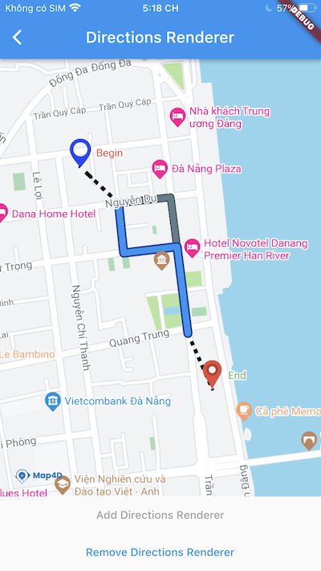

# Directions Renderer

> Map4dMap Flutter SDK cung cấp lớp **MFDirectionsRenderer** để dễ dàng hiển thị các chỉ đường lên bản đồ.



## MFDirectionsRenderer

### Constructors

```dart
const MFDirectionsRenderer({
  required this.rendererId,
  this.routes = const <List<MFLatLng>>[],
  this.directions = "",
  this.activedIndex = 0,
  this.activeStrokeWidth = 8,
  this.activeStrokeColor = Colors.blue,
  this.activeOutlineWidth = 2,
  this.activeOutlineColor = const Color(0xFF0D47A1),
  this.inactiveStrokeWidth = 8,
  this.inactiveStrokeColor = Colors.blueGrey,
  this.inactiveOutlineWidth = 1,
  this.inactiveOutlineColor = const Color(0xFF263238),
  this.originPOIOptions = const MFDirectionsPOIOptions(),
  this.destinationPOIOptions = const MFDirectionsPOIOptions(),
  this.onRouteTap,
});
```

### Properties

| Name                  | Type | Description |
|-----------------------|---|---|
| routes                | [List\<List\<MFLatLng\>\>](https://pub.dev/documentation/map4d_map/latest/map4d_map/MFLatLng-class.html)      | Mảng các mảng tọa độ thể hiện chỉ đường sẽ được hiển thị lên bản đồ. |
| directions            | `string` | Chuỗi json kết quả tìm đường bằng [Map4d Service API](https://docs.map4d.vn/map4d-service/api/) (Get Route).<br>Nếu vừa set cả 2 props `routes` và `directions` thì sẽ ưu tiên hiển thị chỉ đường từ `routes`. |
| activedIndex          | `int`                                               | Chỉ mục chính của tuyến đường trong `routes` hoặc `directions`. Mặc định là 0. |
| activeStrokeWidth     | `int`                                               | Kích thước của tuyến đường chính (xác định bằng `activedIndex`). |
| activeStrokeColor     | [Colors](https://api.flutter.dev/flutter/material/Colors-class.html) | Màu của tuyến đường chính. |
| activeOutlineWidth    | `int`                                               | Kích thước outline của tuyến đường chính.   |
| activeOutlineColor    | [Colors](https://api.flutter.dev/flutter/material/Colors-class.html) | Màu outline của tuyến đường chính. |
| inactiveStrokeWidth   | `int`                                               | Kích thước các tuyến đường phụ (không phải `activedIndex`). |
| inactiveStrokeColor   | [Colors](https://api.flutter.dev/flutter/material/Colors-class.html) | Màu của các tuyến đường phụ. |
| inactiveOutlineWidth  | `int`                                               | Kích thước outline của các tuyến đường phụ  |
| inactiveOutlineColor  | [Colors](https://api.flutter.dev/flutter/material/Colors-class.html) | Màu outline của các tuyến đường phụ. |
| originPOIOptions      | [MFDirectionsPOIOptions](https://pub.dev/documentation/map4d_map/latest/map4d_map/MFDirectionsPOIOptions-class.html) | Các giá trị tùy chọn hiển thị cho POI đánh dấu vị trí bắt đầu. |
| destinationPOIOptions | [MFDirectionsPOIOptions](https://pub.dev/documentation/map4d_map/latest/map4d_map/MFDirectionsPOIOptions-class.html) | Các giá trị tùy chọn hiển thị cho POI đánh dấu vị trí kết thúc. |
| onRouteTap            | [MFDirectionsCallback](https://pub.dev/documentation/map4d_map/latest/map4d_map/MFDirectionsCallback.html) | Hàm được gọi khi người dùng chạm vào tuyến đường trên bản đồ.<br>Giá trị trả về bao gồm index của route được chạm phải. |

### Example

<https://github.com/map4d/map4d-map-flutter/blob/master/example/lib/directions_renderer.dart>

### API Reference

<https://pub.dev/documentation/map4d_map/latest/map4d_map/MFDirectionsRenderer-class.html>

