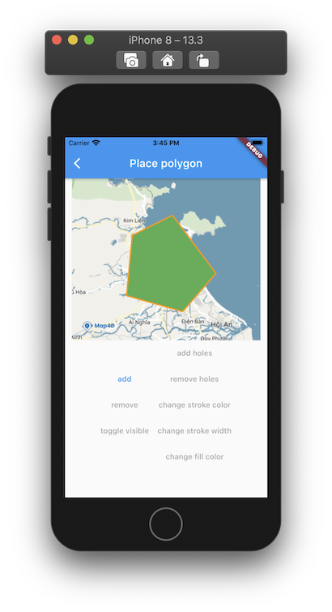

# Polygon

> Để vẽ các đa giác trên bản đồ thì ta sử dụng đối tượng [MFPolygon](//pub.dev/documentation/map4d_map/latest/map4d_map/MFPolygon-class.html).  
Một đối tượng [MFPolygon](//pub.dev/documentation/map4d_map/latest/map4d_map/MFPolygon-class.html) bao gồm một mảng các điểm tọa độ và tạo ra các đoạn thẳng nối các vị trí đó theo một trình tự có thứ tự.

 

## MFPolygon

### Constructors

```dart
const MFPolygon({
  required this.polygonId,
  this.consumeTapEvents = false,
  this.fillColor = Colors.black,
  this.points = const <MFLatLng>[],
  this.holes = const <List<MFLatLng>>[],
  this.strokeColor = Colors.black,
  this.strokeWidth = 10,
  this.visible = true,
  this.zIndex = 0,
  this.onTap,
});
```

### Properties

| Name             | Type                                                                                       | Description                                           |
|------------------|--------------------------------------------------------------------------------------------|-------------------------------------------------------|
| polygonId        | [MFPolygonId](//pub.dev/documentation/map4d_map/latest/map4d_map/MFPolygonId-class.html)   | Id của polygon.                                       |
| consumeTapEvents | `bool` | Default: `false`. Cho phép người dùng có thể tương tác được với polygon hay không. Nếu `false` thì `onTap` callback sẽ không được gọi.    |
| fillColor        | [Color](https://api.flutter.dev/flutter/dart-ui/Color-class.html)                          | Chỉ định màu tô phía trong của Polygon.               |
| points           | [List\<MFLatLng\>](https://pub.dev/documentation/map4d_map/latest/map4d_map/MFLatLng-class.html)         | Mảng các tọa độ để tạo polygon.         |
| holes            | [List\<List\<MFLatLng\>\>](https://pub.dev/documentation/map4d_map/latest/map4d_map/MFLatLng-class.html) | Nhiều mảng các tọa độ để tạo holes cho polygon. |
| strokeColor      | [Color](https://api.flutter.dev/flutter/dart-ui/Color-class.html)                          | Màu sắc đường viền ngoài cùng của polygon.            |
| strokeWidth      | `int`                              | Default: `10`. Độ rộng đường viền của polygon (đơn vị: point).                                                |
| visible          | `bool`                             | Default: `true`. Ẩn hay hiện polygon trên bản đồ.                                                             |
| zIndex           | `int`                              | Default: `0`. Thứ tự hiển thị giữa các Polygon với nhau hoặc giữa polygon với các đối tượng khác trên bản đồ. |
| onTap            | [VoidCallback](https://api.flutter.dev/flutter/dart-ui/VoidCallback.html)                  | Callback được gọi khi người dùng tap vào polygon.     |

## Example

Ví dụ tương tác với polygon có thể xem tại:

<https://github.com/map4d/map4d-map-flutter/blob/master/example/lib/place_polygon.dart>
