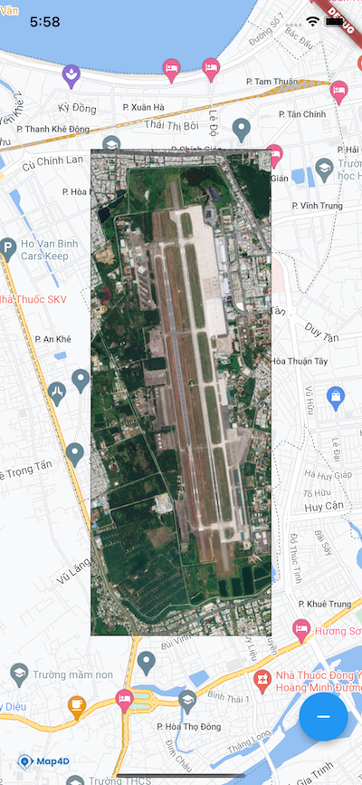

# Image Overlay

> Image Overlay là một loại overlay cho phép người dùng hiển thị một hình ảnh lên một khu vực xác định trên bản đồ Map4D



## Add Image overlay

Để thêm 1 image overlay vào map cần tạo mới 1 đối tượng của lớp [MFImageOverlay](//pub.dev/documentation/map4d_map/latest/map4d_map/MFImageOverlay-class.html) sau đó truyền cho [MFMapView](MFMapView).  

> Đoạn code bên dưới hướng dẫn cách thêm/xóa image overlay trên Map4D.  
Asset: https://github.com/map4d/map4d-map-flutter/blob/master/example/assets/image_overlay.jpg

```dart
// ignore_for_file: use_key_in_widget_constructors
import 'package:flutter/material.dart';
import 'package:map4d_map/map4d_map.dart';

void main() {
  runApp(MyApp());
}

class MyApp extends StatelessWidget {
  @override
  Widget build(BuildContext context) {
    return MaterialApp(
      title: 'Hello Image Overlay',
      home: ImageOverlaySample(),
    );
  }
}

class ImageOverlaySample extends StatefulWidget {
  @override
  _ImageOverlaySampleState createState() => _ImageOverlaySampleState();
}

class _ImageOverlaySampleState extends State<ImageOverlaySample> {
  MFBitmap? _image;
  MFImageOverlay? _imageOverlay;

  void _addRemoveImageOverlay() {
    MFImageOverlay? newImageOverlay;
    if (_imageOverlay == null) {
      const imageOverlayId = MFImageOverlayId('image-overlay-id');
      const northeast = MFLatLng(16.066154, 108.207276);
      const southwest = MFLatLng(16.020262, 108.189487);
      final bounds = MFLatLngBounds(southwest: southwest, northeast: northeast);
      newImageOverlay = MFImageOverlay(imageOverlayId: imageOverlayId, image: _image!, bounds: bounds);
    }
    setState(() {
      _imageOverlay = newImageOverlay;
    });
  }

  @override
  Widget build(BuildContext context) {
    _createImageFromAsset(context);
    Set<MFImageOverlay> overlays = <MFImageOverlay>{
      if (_imageOverlay != null) _imageOverlay!,
    };
    return Scaffold(
      body: MFMapView(
        initialCameraPosition: const MFCameraPosition(
          target: MFLatLng(16.043208, 108.198382),
          zoom: 14.0,
        ),
        imageOverlays: overlays,
      ),
      floatingActionButton: FloatingActionButton(
        onPressed: _addRemoveImageOverlay,
        child: overlays.isEmpty ? const Icon(Icons.add) : const Icon(Icons.remove),
      ),
    );
  }

  Future<void> _createImageFromAsset(BuildContext context) async {
    if (_image == null) {
      final ImageConfiguration imageConfiguration = createLocalImageConfiguration(context);
      _image = await MFBitmap.fromAssetImage(imageConfiguration, 'assets/image_overlay.jpg');
    }
  }
}
```

## MFImageOverlay

### Properties

| No. | Name | Type    | Description |
|:---:|------|---------|-------------|
|  1  | imageOverlayId | [MFImageOverlayId](//pub.dev/documentation/map4d_map/latest/map4d_map/MFImageOverlayId-class.html) | Id của image overlay |
|  2  | image          | [MFBitmap](https://pub.dev/documentation/map4d_map/latest/map4d_map/MFBitmap-class.html) | Hình ảnh hiển thị trên bản đồ |
|  2  | bounds         | [MFLatLngBounds](https://pub.dev/documentation/map4d_map/latest/map4d_map/MFLatLngBounds-class.html) | Khu vực hiển thị hình ảnh |
|  2  | transparency   | double | Độ trong suốt của image overlay. Giá trị mặc định: 0 (không trong suốt) |
|  3  | visible        | bool   | Ẩn/hiện image overlay trên map |
|  4  | zIndex         | int    | Giá trị zIndex của image overlay cao hơn sẽ hiển thị trên image overlay có giá trị zIndex nhỏ hơn |

### Methods

| No. | Name | Return Type | Description |
|:-:|-|-|-|-|
| 1 | clone | [MFImageOverlay](//pub.dev/documentation/map4d_map/latest/map4d_map/MFImageOverlay-class.html) | Clone đối tượng MFImageOverlay |
| 2 | copyWith | [MFImageOverlay](//pub.dev/documentation/map4d_map/latest/map4d_map/MFImageOverlay-class.html) | Clone đối tượng MFImageOverlay với giá trị `zIndex`, `visible` mới. |
