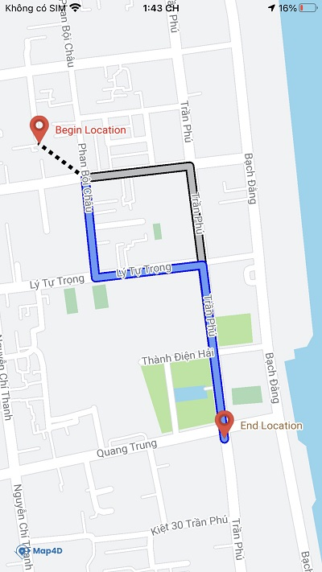

# Directions Renderer

> Map4D Map SDK cung cấp lớp [MFDirectionsRenderer](/reference/directions-renderer) để dễ dàng hiển thị các chỉ đường lên bản đồ.

### 1. Thêm một Directions Renderer vào bản đồ

Để thêm 1 Directions Renderer vào bản đồ, ta tạo mới một đối tượng `MFDirectionsRenderer` và set map cho đối tượng đó.  
Đoạn code sau vẽ một Directions Renderer có 2 route lên bản đồ:

<!-- tabs:start -->
#### ** Swift **

```swift
let renderer = MFDirectionsRenderer();

let route0 = MFMutablePath()
route0.add(CLLocationCoordinate2DMake(16.078814, 108.221592))
route0.add(CLLocationCoordinate2DMake(16.078972, 108.223034))
route0.add(CLLocationCoordinate2DMake(16.075353, 108.223513))

let route1 = MFMutablePath()
route1.add(CLLocationCoordinate2DMake(16.078814, 108.221592))
route1.add(CLLocationCoordinate2DMake(16.077491, 108.221735))
route1.add(CLLocationCoordinate2DMake(16.077659, 108.223212))
route1.add(CLLocationCoordinate2DMake(16.075353, 108.223513))

renderer.routes = [route0, route1]
renderer.originPosition = CLLocationCoordinate2DMake(16.079264, 108.220959)
renderer.originTitle = "Begin Location"
renderer.originTitleColor = .red
renderer.destinationTitle = "End Location"
renderer.destinationTitleColor = .brown

renderer.map = mapView
```

#### ** Objective C **

```objc 
MFDirectionsRenderer* renderer = [[MFDirectionsRenderer alloc] init];

MFMutablePath* route0 = [[MFMutablePath alloc] init];
[route0 addCoordinate:CLLocationCoordinate2DMake(16.078814, 108.221592)];
[route0 addCoordinate:CLLocationCoordinate2DMake(16.078972, 108.223034)];
[route0 addCoordinate:CLLocationCoordinate2DMake(16.075353, 108.223513)];

MFMutablePath* route1 = [[MFMutablePath alloc] init];
[route1 addCoordinate:CLLocationCoordinate2DMake(16.078814, 108.221592)];
[route1 addCoordinate:CLLocationCoordinate2DMake(16.077491, 108.221735)];
[route1 addCoordinate:CLLocationCoordinate2DMake(16.077659, 108.223212)];
[route1 addCoordinate:CLLocationCoordinate2DMake(16.075353, 108.223513)];

renderer.routes = @[route0, route1];
renderer.originPosition = CLLocationCoordinate2DMake(16.079264, 108.220959);
renderer.originTitle = @"Begin Location";
renderer.originTitleColor = UIColor.redColor;
renderer.destinationTitle = @"End Location";
renderer.destinationTitleColor = UIColor.brownColor;

renderer.map = mapView;
```
<!-- tabs:end -->

 

### 2. Xóa Directions Renderer khỏi bản đồ

Để xóa **Directions Renderer** khỏi bản đồ, chúng ta **set** thuộc tính **map** bằng **nil**

<!-- tabs:start -->
#### ** Swift **

```swift
renderer.map = nil
```

#### ** Objective C **

```objc 
renderer.map = nil;
```
<!-- tabs:end -->

### 3. Tùy chỉnh cho Directions Renderer

Bạn có thể dễ dàng tuỳ chỉnh **Directions Renderer** thông qua các thuộc tính mà **MFDirectionsRenderer** cung cấp như sau:

| Name                    | Description                                                                                    |
|-------------------------|------------------------------------------------------------------------------------------------|
| routes                  | Tùy chỉnh các chỉ đường cho Directions Renderer.                                               |
| activedIndex            | Chọn index của chỉ đường chính (trong trường hợp có nhiều chỉ đường).                          |
| hideOriginPOI           | Ẩn hiện POI đánh dấu vị trí bắt đầu.                                                           |
| originPosition          | Vị trí bắt đầu (nếu không thiết lập thì vị trí bắt đầu trùng với vị trí đầu của chỉ đường).    |
| originIcon              | Icon cho vị trí bắt đầu (set nil thì lấy giá trị mặc định).                                    |
| originGroundAnchor      | Xác định điểm neo cho icon của vị trí bắt đầu                                                  |
| originTitle             | Title cho vị trí bắt đầu.                                                                      |
| originTitleColor        | Màu sắc của title cho vị trí bắt đầu.                                                          |
| hideDestinationPOI      | Ẩn/hiện POI đánh dấu vị trí kết thúc.                                                          |
| destinationPosition     | Vị trí kết thúc (nếu không thiết lập thì vị trí kết thúc trùng với vị trí cuối của chỉ đường). |
| destinationIcon         | Icon cho vị trí kết thúc (set nil thì lấy giá trị mặc định).                                   |
| destinationGroundAnchor | Xác định điểm neo cho icon của vị trí kết thúc                                                 |
| destinationTitle        | Title cho vị trí kết thúc.                                                                     |
| destinationTitleColor   | Màu sắc của title cho vị trí kết thúc.                                                         |
| activeStrokeWidth       | Chiều rộng chỉ đường của đường chính (được set activeIndex).                                   |
| activeStrokeColor       | Màu của chỉ đường chính.                                                                       |
| activeOutlineWidth      | Chiều rộng viền của đường chính.                                                               |
| activeOutlineColor      | Màu viền của đường chính.                                                                      |
| inactiveStrokeWidth     | Chiều rộng của đường phụ (có index khác với activeIndex).                                      |
| inactiveStrokeColor     | Màu của đường phụ.                                                                             |
| inactiveOutlineWidth    | Chiều rộng viền của đường phụ.                                                                 |
| inactiveOutlineColor    | Màu viền của đường phụ.                                                                        |

### 4. Sự kiện tap on Directions Renderer

Map4D SDK cung cấp delegate trong `MFMapViewDelegate` để ứng dụng có thể xác định được khi nào người dùng chạm vào Directions Renderer.  
Delegate cung cấp đối tượng Directions Renderer phát sinh sự kiện vào route index mà người dùng chạm vào.  
Để sử dụng Directions Renderer delegate, ta implement phương thức từ protocol `MFMapViewDelegate`.

  <!-- tabs:start -->

  #### ** Swift **

  ```swift 
  func mapView(_ mapView: MFMapView?, didTap renderer: MFDirectionsRenderer?, routeIndex: Int) {}
  ```

  #### ** Objective C **

  ```objc 
  - (void)mapView:(MFMapView*)mapView didTapDirectionsRenderer:(MFDirectionsRenderer*)renderer routeIndex:(NSUInteger)routeIndex {}
  ```

  <!-- tabs:end -->