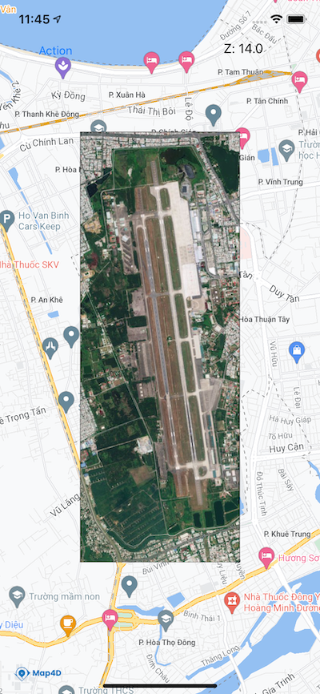

# Image Overlay

Image Overlay là một loại overlay cho phép người dùng hiển thị một hình ảnh có sẵn lên một vùng tọa độ xác định trên Map4D.



## Add Image overlay

Để thêm 1 image overlay vào map cần tạo mới 1 đối tượng của lớp [MFImageOverlay](reference/image-overlay?id=mfimageoverlay-class) sau đó set `map` cho đối tượng đó.  

### Tạo mới Tile overlay

Đoạn code bên dưới hướng dẫn cách sử dụng [MFImageOverlay](reference/tile-overlay?id=mfimageoverlay-class) để hiển thị một hình ảnh lên Map4D:

<!-- tabs:start -->
#### ** Swift **
```swift
let bounds = MFCoordinateBounds(coordinate: CLLocationCoordinate2D(latitude: 16.066154, longitude: 108.207276),
                               coordinate1: CLLocationCoordinate2D(latitude: 16.020262, longitude: 108.189487))
let image = UIImage(named: "default_overlay")
let imageOverlay = MFImageOverlay(image: image!, bounds: bounds)
imageOverlay.map = mapView
```

#### ** Objective-C **
```objc
MFCoordinateBounds *bounds = [[MFCoordinateBounds alloc] initWithCoordinate:CLLocationCoordinate2DMake(16.066154, 108.207276)
                                                                coordinate1:CLLocationCoordinate2DMake(16.020262, 108.189487)];
UIImage *image = [UIImage imageNamed:@"default_overlay"];
MFImageOverlay *imageOverlay = [MFImageOverlay imageOverlayWithImage:image bounds:bounds];
imageOverlay.map = mapView;
```
<!-- tabs:end -->

### Remove image overlay

Để xoá image overlay khỏi map, ta set đối tượng `map` của image overlay về rỗng
<!-- tabs:start -->
#### ** Swift **
```swift
imageOverlay.map = nil
```
#### ** Objective-C **
```objc
imageOverlay.map = nil;
```
<!-- tabs:end -->

### Ẩn/Hiện Image Overlay
Set giá trị cho thuộc tính `isHidden` để ẩn/hiện image overlay.

<!-- tabs:start -->
#### ** Swift **
```swift
imageOverlay.isHidden = true
```
#### ** Objective-C **
```objc
imageOverlay.isHidden = YES;
```
<!-- tabs:end -->

### Thay đôi độ trong suốt của Image Overlay

Để thay đổi độ trong suốt của hình ảnh, ta set giá trị `opacity` cho đối tượng image overlay.  
Chú ý: opacity chỉ nhận giá trị trong khoảng 0 -> 1

<!-- tabs:start -->
#### ** Swift **
```swift
imageOverlay.opacity = 0.5
```
#### ** Objective-C **
```objc
imageOverlay.opacity = 0.5;
```
<!-- tabs:end -->