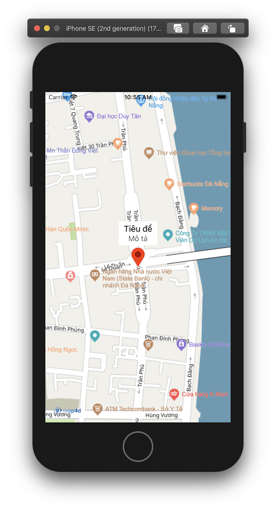

# Marker
Lớp MFMarker cho phép người dùng vẽ một Marker lên map.


## 1. MFMarker

  ``` switf
  class MFMarker: MFOverlay {
    var position: CLLocationCoordinate2D?
    var groundAnchor = CGPoint.zero
    var elevation = 0.0
    var rotation = 0.0
    var draggable = false

    /// The info window anchor specifies the point in the icon image at which to anchor the info window,
    /// which will be displayed directly above this point. This point is specified within the same space
    /// as groundAnchor.
    var infoWindowAnchor = CGPoint.zero

    /// Title, a short description of the overlay. Some overlays, such as markers, will display the title on the map. The title is also the default accessibility text.
    var title: String?

    /// Snippet text, shown beneath the title in the info window when selected.
    var snippet: String?
    var iconView: UIView?
    var icon: UIImage?

    /// A Boolean value that determines whether user events are ignored and removed from the event queue.
    var userInteractionEnabled = false
    override init() {}
  }
  ```

## 2. Tạo Marker 

 
- Tạo marker với position, title, snippet và cài đặt map cho nó như hình phía trên.

  ```swift
  let marker = MFMarker()
  marker.position = CLLocationCoordinate2DMake(16.0718918,108.2239449)
  marker.title = "Tiêu đề"
  marker.snippet = "Mô tả"
  marker.map = mapView
  ```

## 3. Xoá Marker 

- Marker có thể xoá bằng cách cài đặt map cho nó bằng nil.
  ```
  marker.map = nil
  ```

## 4. Tuỳ chỉnh Marker

- Marker có thể tuỳ chỉnh thông qua các thuộc tính như rotation, groundAnchor, elevation, ...
  ``` 
  marker.groundAnchor =  CGPoint(x: 0.5, y: 0.5)
  marker.draggable = true
  marker.elevation = 0
  ```
- **Chú ý**:
- Người dùng có thể sử dụng hình ảnh để biểu diển marker bằng 2 cách
  - ***Sử dụng 1 hình ảnh làm icon dùng hàm setIcon***
  - ***Tuỳ biến lại marker bằng cách dùng hàm setIconView***

## 5. Sự kiện click Marker

  - **Chú ý**:
  - Để sử dụng các sự kiện của marker phải gán thuộc tính userInteractionEnabled = true
  
  ### 5.1. Click Marker
  - Phát sinh khi người dùng click vào marker
  - Cung cấp thông tin của marker cho người dùng
    ```
    func mapview(_ mapView: MFMapView?, didTap marker: MFMarker?) -> Bool {
      return true
    }
    ```

  - **true**: cho phép tuỳ chọn lại sự kiện click vào marker
  - **false**: sử dụng event mặc định là click vào marker hiển thị lên thông tin marker
  
  ### 5.2. Draggable Marker
  - Được kích hoạt khi người dùng cài đặt thuộc tính draggable = true. Phát sinh khi người dùng giữ marker.
  - Cho phép người dùng di chuyển marker trực tiếp trên map

    ```
    func mapview(_ mapView: MFMapView?, didBeginDragging marker: MFMarker?) {}
    func mapview(_ mapView: MFMapView?, didEndDragging marker: MFMarker?) {}
    func mapview(_ mapView: MFMapView?, didDrag marker: MFMarker?) {}
    ```
  
  ### 5.3. Click infoWindow Marker
  - Phát sinh khi người dùng chạm vào marker.
  - Cho phép tuỳ chọn lại hiển thị thông tin marker
    ```  
    func mapview(_ mapView: MFMapView?, didTapInfoWindowOf marker: MFMarker?) {}
    ```


License
-------

Copyright (C) 2016 IOT Link Ltd. All Rights Reserved.