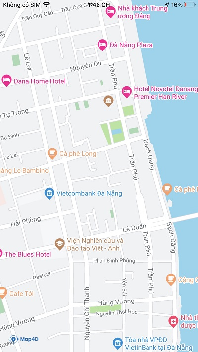
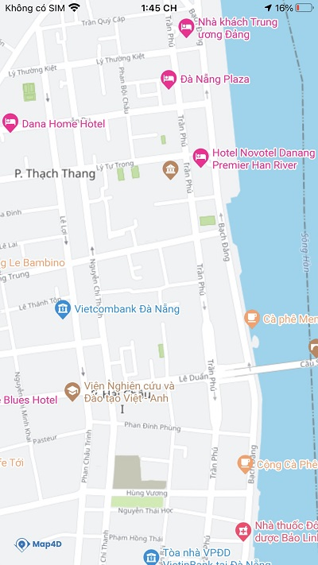
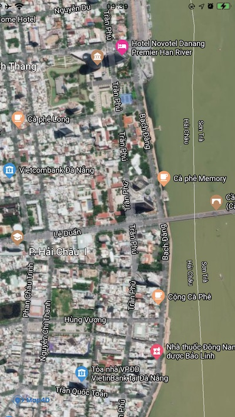
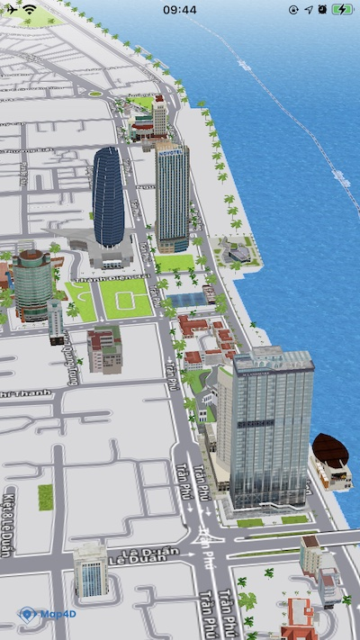

# Map Types

> Map type xác định cách hiển thị và trình bày các tiles trong bản đồ. Bạn có thể tùy chỉnh bản đồ của mình bằng một số loại mà Map4D Map SDK cung cấp

### Các loại bản đồ

Map4D Map SDK hiện cung cấp 4 loại bản đồ tùy chỉnh:

| No. | Name      | Description                                                                                                                                                           |
|:---:|-----------|-----------------------------------------------------------------------------------------------------------------------------------------------------------------------|
|  1  | Roadmap   | Giá trị: `MFMapTypeRoadmap`<br>Các thành phần của bản đồ được vẽ dưới dạng các đường nét và hình khối, có độ phân giải cao<br>Đây là bản đồ mặc định của Map4dMap SDK |
|  2  | Raster    | Giá trị: `MFMapTypeRaster`<br>Các tiles của bản đồ được hiển thị dưới dạng hình ảnh đã được dựng sẵn, tốc độ tải và hiển thị nhanh hơn so với roadmap.                |
|  3  | Satellite | Giá trị: `MFMapTypeSatellite`<br>Các tiles của bản đồ được hiển thị dưới dạng hình ảnh vệ tinh.                                                                       |
|  4  | Map3D     | Giá trị: `MFMapTypeMap3D`<br>Bản đồ hiển thị ở chế độ 3D.                                                                                                             |

|                 ROADMAP                         | RASTER                                         |                 SATELLITE                         | MAP3D                                         |
|:-----------------------------------------------:|:----------------------------------------------:|:-------------------------------------------------:|:---------------------------------------------:|
|  |  |  |  |

### Thay đổi loại bản đồ

Để thay đổi loại bản đồ, ta gán một giá trị cho property `mapType` của class [MFMapView](/reference/map?id=mfmapview-class)  
Ví dụ: để hiển thị bản đồ dạng raster:

<!-- tabs:start -->

#### ** Swift **

```swift 
mapView.mapType = .raster
```

#### ** Objective C **

```objc 
mapView.mapType = MFMapTypeRaster;
```

<!-- tabs:end -->