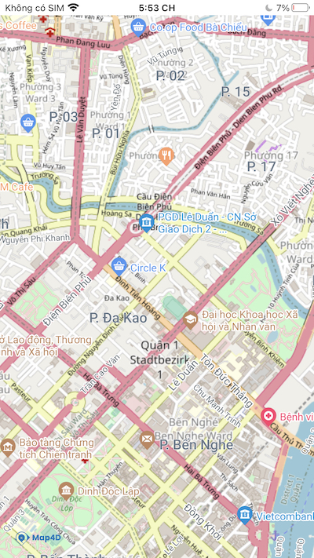

# Tile Overlay

> Tile Overlay là một loại overlay cho phép người dùng hiển thị các tile map khác nhau từ nhiều nguồn khác nhau lên trên tile map có sẵn của Map4D



## MFTileOverlay

Map4dMap SDK cung cấp một react view MFTileOverlay để hiển thị tile overlay lên bản đồ.  

### Usage
Để sử dụng, ta import `MFTileOverlay` từ thư viện `react-native-map4d-map` như sau:
```javascript
import { MFTileOverlay } from 'react-native-map4d-map';
```
Sau đó add vào [MFMapView](guides/mapview.md) như 1 subview:
```javascript
<MFMapView>
  <MFTileOverlay/>
</MFMapView>
```

- Ví dụ:
```javascript
<MFMapView ref={ref => this.map = ref}
  style={this.styles.container}
  camera={{
    center: { longitude: 106.700587, latitude: 10.789113 },
    zoom: 15,
    bearing: 0,
    tilt: 0,
  }}
  >
  <MFTileOverlay urlTemplate="https://tile.openstreetmap.de/{z}/{x}/{y}.png"/>
</MFMapView>
```

### MFTileOverlay props

| Name        | Type   | Description                                                                                                                                           |
|-------------|--------|-------------------------------------------------------------------------------------------------------------------------------------------------------|
| urlTemplate | string | Mẫu đường dẫn trỏ tới server tile, có dạng: https://example.com/{z}/{x}/{y}.png<br>Chuỗi {z}, {x}, {y} sẽ được thay thế trong quá trình request tile. |
| visible     | bool   | Set `false` nếu không muốn hiển thị tile overlay lên bản đồ, mặc định là `true`.                                                                      |
| zIndex      | number | Xác định thứ tự hiển thị giữa các tile overlay với nhau. Giá trị mặc định là `0`.                                             |
