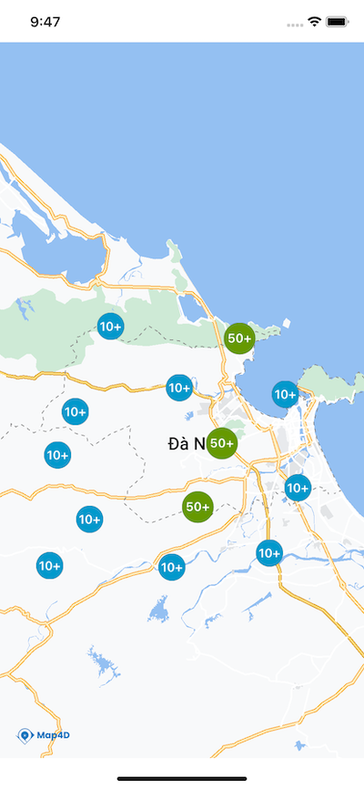

# Marker Cluster

> Map4D Map SDK cung cấp lớp **MFMarkerCluster** và **MFClusterItem** hỗ trợ hiển thị một số lượng lớn các marker thành từng nhóm,  
theo từng mức zoom để giúp việc hiển thị nhiều marker được rõ ràng hơn, đỡ rối rắm cho người dùng

## Thêm marker cluster vào bản đồ



Để hiển thị marker cluster lên bản đồ Map4D, ta sử dụng `MFMarkerCluster` trong `MFMapView` để chứa một số lượng lớn các `MFClusterItem`  
Ví dụ bên dưới cho phép tạo các `MFClusterItem` và hiển thị `MFMarkerCluster` lên bản đồ

```js
import {MFMapView, MFMarkerCluster, MFClusterItem} from 'react-native-map4d-map';
import React from 'react';
import {
  SafeAreaView,
  StyleSheet
} from 'react-native';

function App() {
  const maxClusterItemCount = 500
  const camera = {latitude: 16.0432432, longitude: 108.032432}
  const extent = 0.2
  
  let _randomScale = () => {
    return Math.random() * 2.0 - 1.0
  }

  let _generateClusterItems = () => {
    let items = []
    for (let index = 1; index <= maxClusterItemCount; ++index) {
      let lat = camera.latitude + extent * _randomScale()
      let lng = camera.longitude + extent * _randomScale()
      items.push(
        <MFClusterItem
          key={index}
          coordinate={{latitude: lat, longitude: lng}}
          title={`Cluster Item ${index}`}
          onPress={(e) => console.log(`Tap at cluster item ${index}:`, e.nativeEvent)}
          onPressInfoWindow={(e) => console.log(`Tap at cluster item ${index} info window:`, e.nativeEvent)}
        />
      )
    }
    return items
  }

  const items = _generateClusterItems()

  const onPressCluster = async (e) => {
    let cluster = e.nativeEvent.cluster
    let camera = await map.getCamera()
    camera.center = cluster.location
    camera.zoom = camera.zoom + 1
    map.animateCamera(camera)
  }
  
  return (
    <>
      <SafeAreaView style={styles.safeView}>
        <MFMapView style={styles.container}
          camera={{
            center: camera,
            zoom: 10,
            bearing: 0,
            tilt: 0,
          }}
          ref={ref => map = ref}
        >
          <MFMarkerCluster onPressCluster={onPressCluster}>
            {items}
          </MFMarkerCluster>
        </MFMapView>
      </SafeAreaView>
    </>
  );
};

const styles = StyleSheet.create({
  safeView: {
    flex: 1,
  },
  container: {
    flex: 1,
  },
});

export default App;
```

## MFMarkerCluster

Sử dụng:
```javascript
import { MFMarkerCluster } from 'react-native-map4d-map';
```

### Props

| Name                  | Type | Description |
|-----------------------|------|-------------|
| [onPressCluster](#onPressCluster)   | func | Hàm được gọi khi người dùng chạm vào cụm nhiều cluster item. |

#### onPressCluster

Giá trị `nativeEvent` trả về của đối tượng event khi sự kiện `onPressCluster` được gọi là một object, có dạng như sau:

```js
{
  "action": "marker-cluster-press",
  "cluster": {
    "location": {
      "latitude": number,
      "longitude": number
    },
    "size": number
  }
}
```

Trong đó:
  - cluster: thông tin cụm các cluster item mà người dùng chạm vào
    + location: vị trí cụm cluster item trên bản đồ.
    + size: số lượng cluster item trong cụm đó


## MFClusterItem

Sử dụng:
```javascript
import { MFClusterItem } from 'react-native-map4d-map';
```

### Props

| Name                  | Type | Description |
|-----------------------|------|-------------|
| coordinate            | [CoordinateData](guides/marker?id=coordinatedata) | Vị trí của marker cluster item trên bản đồ. |
| title                                   | string | Tiêu đề của marker cluster item, sẽ được hiển thị trong info window. |
| snippet                                 | string | Snippet của marker cluster item, sẽ được hiển thị trong info window. |
| [onPress](#onPress)                     | func   | Hàm được gọi khi người dùng chạm vào cluster item.                   |
| [onPressInfoWindow](#onPressInfoWindow) | func   | Hàm được gọi khi người dùng chạm vào infor window của cluster item.  |

#### onPress

Giá trị `nativeEvent` trả về của đối tượng event khi sự kiện `onPress` được gọi là một object, có dạng như sau:

```js
{
  "action": "cluster-item-press",
  "clusterItem": {
    "location": {
      "latitude": number,
      "longitude": number
    }
  },
  "location": {
    "latitude": number,
    "longitude": number
  },
  "pixel": {
    "x": number,
    "y": number
  }
}
```

Trong đó:
  - location: vị trí mà người dùng tap trên bản đồ, theo hệ tọa độ địa lý.
  - pixel: vị trí mà người dùng tap trên bản đồ, theo hệ tọa độ màn hình.
  - clusterItem: thông tin trả về cho marker cluster item, bao gồm:
    + location: vị trí hiển thị hiện tại của marker cluster item trên bản đồ, theo hệ tọa độ địa lý.

#### onPressInfoWindow

Giá trị `nativeEvent` trả về của đối tượng event khi sự kiện `onPressInfoWindow` được gọi là một object, có dạng như sau:

```js
{
  "action": "cluster-item-info-window-press",
  "clusterItem": {
    "location": {
      "latitude": number,
      "longitude": number
    }
  },
  "location": {
    "latitude": number,
    "longitude": number
  },
  "pixel": {
    "x": number,
    "y": number
  }
}
```

Trong đó:
  - location: vị trí mà người dùng tap trên bản đồ, theo hệ tọa độ địa lý.
  - pixel: vị trí mà người dùng tap trên bản đồ, theo hệ tọa độ màn hình.
  - clusterItem: thông tin trả về cho marker cluster item, bao gồm:
    + location: vị trí hiển thị hiện tại của marker cluster item trên bản đồ, theo hệ tọa độ địa lý.