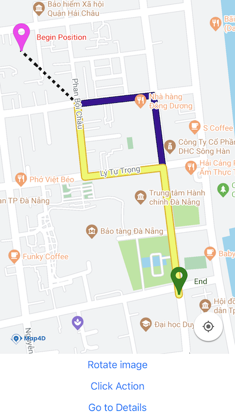

# Directions Renderer

> Map4D Map SDK cung cấp lớp **MFDirectionsRenderer** để dễ dàng hiển thị các chỉ đường lên bản đồ.

## MFDirectionsRenderer



Sử dụng:
```javascript
import { MFDirectionsRenderer } from 'react-native-map4d-map';
```

### Add Directions Renderer

```javascript
render() {
  return (
    <MFMapView ref={ref => this.map = ref} >
      <MFDirectionsRenderer
        ref={ref => this.directions = ref}
        routes={[
          [
            { latitude: 16.078814, longitude: 108.221592 },
            { latitude: 16.078972, longitude: 108.223034 },
            { latitude: 16.075353, longitude: 108.223513 },
          ],
          [
            { latitude: 16.078814, longitude: 108.221592 },
            { latitude: 16.077491, longitude: 108.221735 },
            { latitude: 16.077659, longitude: 108.223212 },
            { latitude: 16.075353, longitude: 108.223513 }
          ]
        ]}
        activedIndex={1}
        activeStrokeWidth={10}
        activeStrokeColor="#edf75c"
        activeOutlineWidth={2}
        activeOutlineColor="#e3b314"
        inactiveStrokeWidth={10}
        inactiveStrokeColor="#3d1294"
        inactiveOutlineWidth={1}
        inactiveOutlineColor="#1f113b"
        originPOIOptions={{
          coordinate: { latitude: 16.079774, longitude: 108.220534 },
          title: "Begin Position",
          titleColor: "#ff0000",
          icon:{ uri: require('./assets/marker-pink.png') },
          visible: true
        }}
        destinationPOIOptions={{
          title: "End",
          titleColor: "#0c4503",
          icon:{ uri: require('./assets/marker-green.png') },
          visible: true
        }}
        onPress={
          (event) => {
            this.directions.setActivedIndex(event.nativeEvent.routeIndex)
          }
        }
      />
    </MFMapView>
  );
}
```

### Props

| Name                  | Type | Description |
|-----------------------|---|---|
| routes                | array[array[[CoordinateData](#CoordinateData)]]      | Mảng các mảng tọa độ thể hiện chỉ đường sẽ được hiển thị lên bản đồ. |
| directions            | string | Chuỗi json kết quả tìm đường bằng [Map4d Service API](https://docs.map4d.vn/map4d-service/api/) (Get Route).<br>Nếu vừa set cả 2 props `routes` và `directions` thì sẽ ưu tiên hiển thị chỉ đường từ `routes`. |
| activedIndex          | number                                               | Chỉ mục chính của tuyến đường trong `routes` hoặc `directions`. Mặc định là 0. |
| activeStrokeWidth     | number                                               | Kích thước của tuyến đường chính (xác định bằng `activedIndex`). |
| activeStrokeColor     | [ColorPropType](https://reactnative.dev/docs/colors) | Màu của tuyến đường chính. |
| activeOutlineWidth    | number                                               | Kích thước outline của tuyến đường chính.   |
| activeOutlineColor    | [ColorPropType](https://reactnative.dev/docs/colors) | Màu outline của tuyến đường chính. |
| inactiveStrokeWidth   | number                                               | Kích thước các tuyến đường phụ (không phải `activedIndex`). |
| inactiveStrokeColor   | [ColorPropType](https://reactnative.dev/docs/colors) | Màu của các tuyến đường phụ. |
| inactiveOutlineWidth  | number                                               | Kích thước outline của các tuyến đường phụ  |
| inactiveOutlineColor  | [ColorPropType](https://reactnative.dev/docs/colors) | Màu outline của các tuyến đường phụ. |
| originPOIOptions      | [POIOptionsData](#POIOptionsData)                    | Các giá trị tùy chọn hiển thị cho POI đánh dấu vị trí bắt đầu. |
| destinationPOIOptions | [POIOptionsData](#POIOptionsData)                    | Các giá trị tùy chọn hiển thị cho POI đánh dấu vị trí kết thúc. |
| [onPress](#onPress)   | func | Hàm được gọi khi người dùng chạm vào tuyến đường trên bản đồ.<br>Giá trị trả về bao gồm index của route được chạm phải. |

### Methods

| Name                       | Parameters    | Description                                                                                                                            |
|----------------------------|---------------|----------------------------------------------------------------------------------------------------------------------------------------|
| **setRoutes** *void*       | routes: array[array[[CoordinateData](#CoordinateData)]] | Set các tuyến đường dưới dạng mảng các mảng tọa độ lat, lng.                                 |
| **setDirections** *void*   | json: string  | Set các tuyến đường dưới dạng json string từ kết quả trả về từ [Map4d Service API](https://docs.map4d.vn/map4d-service/api/) Get Route |
| **setActivedIndex** *void* | index: number | Set chỉ mục tuyến đường chính.                                                                                                         |

### Object Types

#### POIOptionsData

| Name       | Type                                                 | Description                                     |
|------------|------------------------------------------------------|-------------------------------------------------|
| coordinate | [CoordinateData](#CoordinateData)                    | Tọa độ của vị trí bắt đầu (kết thúc) chỉ đường.<br>Nếu không set thì sẽ vị trí bắt đầu (kết thúc) chỉ đường trùng với vị trí bắt đầu (kết thúc) trong props `routes` hoặc `directions`. |
| icon       | [IconData](#IconData)                                | Hình ảnh hiển thị cho POI                       |
| title      | string                                               | Tiêu đề của POI                                 |
| titleColor | [ColorPropType](https://reactnative.dev/docs/colors) | Màu sắc cho tiêu đề.                            |
| visible    | bool                                                 | Ẩn/hiện POI đánh dấu vị trí bắt đầu (kết thúc). |

Ví dụ:

```js
let options = {
  coordinate: {latitude: 10.7881732, longitude: 106.7000933},
  icon: {uri: require('./assets/poi_icon.png')},
  title: "Start position",
  titleColor: "#FF0000",
  visible: true
}
```

#### CoordinateData

```js
{
  latitude: number,
  longitude: number
}
```

Thông tin tọa độ theo kinh độ, vĩ độ

Ví dụ:

```js
let coordinate = {latitude: 10.7881732, longitude: 106.7000933}
```

#### IconData

Thông tin custom icon cho POI

```js
{
  uri: string
}
```
Trong đó:
- uri: đường dẫn đến hình ảnh

Ví dụ:

```js
let icon1 = {uri: 'https://example.com/poi_icon.png'}
let icon2 = {uri: require('./assets/poi_icon.png')}
```

### Events

#### onPress

Được gọi khi người dùng tap vào `Direction Renderer` trên bản đồ.  
Giá trị `nativeEvent` trả về của đối tượng event khi sự kiện `onPress` được gọi là một object, có dạng như sau:

```js
{
  action: "directions-press",
  location: {
    latitude: number,
    longitude: number
  },
  pixel: {
    x: number,
    y: number
  },
  routeIndex: number
}
```

Trong đó:
  - location: vị trí mà người dùng tap trên bản đồ, theo hệ tọa độ địa lý.
  - pixel: vị trí mà người dùng tap trên bản đồ, theo hệ tọa độ màn hình.
  - routeIndex: index của tuyến đường mà người dùng tap vào.
