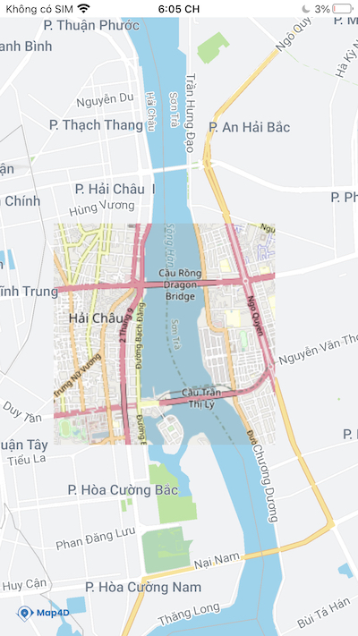

# Ground Overlay
> Ground Overlay cho phép người dùng thực hiện việc thay thế tile ở một khu vực nào đó bằng tile từ những nguồn khác.  
> Ground Overlay tương tự với [Tile Overlay](guides/tile-overlay.md) nhưng cho phép người dùng quy định 1 khu vực cụ thể gắn với kinh độ/vĩ độ,  
> ngoài ra con cho phép người dùng loại bỏ việc hiển thị tile và các đối tượng thuộc tile của Map4D SDK.  

> Ground Overlay rất hữu ích khi bạn muốn sửa hình ảnh tại một số khu vực trên bản đồ.



## MFGroundOverlay

Map4dMap SDK cung cấp một react view MFGroundOverlay để hiển thị ground overlay lên bản đồ.  

### Usage
Để sử dụng, ta import `MFGroundOverlay` từ thư viện `react-native-map4d-map` như sau:
```javascript
import { MFGroundOverlay } from 'react-native-map4d-map';
```
Sau đó add vào [MFMapView](guides/mapview.md) như 1 subview:
```javascript
<MFMapView>
  <MFGroundOverlay/>
</MFMapView>
```

- Ví dụ:

```js
<MFMapView ref={ref => this.map = ref}
  onCameraIdle={(e) => console.log('idle:', e.nativeEvent)}
  style={this.styles.container}
  camera={{
    center: { latitude: 16.057086, longitude: 108.227777 },
    zoom: 14,
    bearing: 0,
    tilt: 0,
  }}
>
  <MFGroundOverlay
    urlTemplate="https://tile.openstreetmap.de/{z}/{x}/{y}.png"
    bounds={{
      northEast: { latitude: 16.064290, longitude: 108.232498 },
      southWest: { latitude: 16.057815, longitude: 108.220654 },
    }}
    override={true}
    zIndex={10}
    visible={true}
/>
</MFMapView>
```

### MFGroundOverlay props

| Name        | Type    | Description                                                                                                                                                                 |
|-------------|---------|-----------------------------------------------------------------------------------------------------------------------------------------------------------------------------|
| urlTemplate | string  | Mẫu đường dẫn trỏ tới server tile, có dạng: https://example.com/{z}/{x}/{y}.png<br>Chuỗi {z}, {x}, {y} sẽ được thay thế trong quá trình request tile.                       |
| bounds      | [CoordinateBounds](#CoordinateBounds) | Khu vực sẽ hiển thị ground overlay.                                                                                                           |
| override    | bool    | Nếu bằng `true`, tại khu vực hiển thị ground overlay thì các đối tượng của Map4D sẽ không được hiển thị.<br>Bao gồm: base map, poi và building. Giá trị mặc định là `fasle` |
| visible     | bool    | Set `false` nếu không muốn hiển thị ground overlay lên bản đồ, mặc định là `true`.                                                                                          |
| zIndex      | number  | Xác định thứ tự hiển thị giữa các ground overlay với nhau hoặc với tile overlay.                                                                                            |

#### CoordinateBounds

Coordinate bounds là đối tượng javascript dùng để xác định 1 khu vực tọa độ nào đó, bao gồm `southWest` và `northEast`:

```js
{
  northEast: {
    latitude: number,
    longitude: number
  },
  southWest: {
    latitude: number,
    longitude: number
  }
}
```
