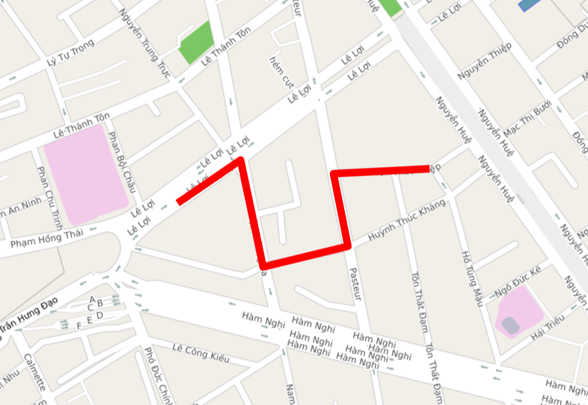
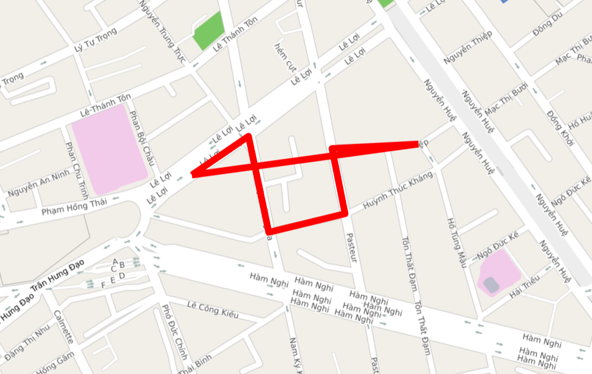

# Polyline
Lớp Polyline cho phép người dùng vẽ một polyline lên bản đồ.

## 1. Polyline & PolylineOptions

```javascript
  interface PolylineOptions {
    path: ILatLng[] // Một mảng danh sách các toạ độ cần vẽ polyline lên map
    strokeWidth?: number // Chiều rộng polyline tính bằng point
    strokeColor?: string // Màu sắc marker bằng mã hex
    strokeOpacity?: number // Độ trong suốt
    visible?: boolean // Ẩn hoặc hiện polyline
    closed?: boolean // Cho phép nối điểm đầu và điểm cuối lại với nhau.
    draggable?: boolean // Cho phép kéo Polyline di chuyển trên bản đồ bằng chuột trái, default = false
    zIndex?: number  // Thứ tự vẽ của Polyline, default = 0
    bringFrontBuilding?: boolean  // Vẽ phía trước hoặc phía sau Building, default = false
  }

  class Polyline {
    constructor(options: PolylineOptions) // Khởi tạo polyline với PolylineOptions
    getPath(): LatLng[] // Lấy thông tin danh sách cách toạ độ cần vẽ polyline
    getMap(): Map // Lấy thông tin map.
    setMap(map: Map): void // Cài đặt map cần vẽ.
    setPath(path: ILatLng[]): void // Cài đặt danh sách các toạ độ cần vẽ.
    setStrokeWidth(strokeWidth: number): void // Cài đặt chiều rộng polyline.
    setClosed(closed: boolean): void // Cho phép nối điểm đầu và điểm cuối.
    setStrokeColor(strokeColor: string): void // Cài đặt màu sắc polyline.
    setStrokeOpacity(strokeOpacity: number): void // Cài đặt độ trong suốt cho polyline.
    setVisible(visible: boolean): void // Cài đặt ẩn hiện polyline.
    getStrokeWidth(): number // Lấy chiều rộng polyline
    getStrokeColor(): string // Lấy màu sắc polyline.
    getStrokeOpacity(): number // Lấy độ trong suốt polyline
    isVisible(): boolean // Kiểm tra ẩn hiện polyline
    isClosed(): boolean // Kiểm tra điểm đầu và điểm cuối có nối lại với nhau không ?
    getZIndex(): boolean // lấy giá trị của zIndex
    setZIndex(zIndex: number): void  // cài đặt giá trị zIndex
    isBringFrontBuilding(): boolean  // lấy giá trị bringFrontBuilding
    setBringFrontBuilding(bringFrontBuilding: boolean): void // cài đặt giá trị của bringFrontBuilding

    getUserData(): any // Lấy user data được gán cho polyline
    setUserData(data: any) // Thêm user data cho polyline
    isDraggable(): boolean // lấy giá trị của draggable
    setDraggable(value: boolean): void // cài đặt giá trị của draggable
  }
```


## 2. Tạo polyline

```javascript
  //tạo đối tượng polyline từ PolylineOptions
  let polyline = new map4d.Polyline({
        path: [
          [10.772431, 106.699380],
          [10.773201, 106.700147],
          [10.771783, 106.700763],
          [10.772302, 106.701901],
          [10.773267, 106.701493],
          [10.773599, 106.702835]
        ],
        strokeColor: "#ff0000",
        strokeOpacity: 1.0,
        strokeWidth: 10})
  //thêm polyline vào map    
  polyline.setMap(map)
```

Như ví dụ trên vẽ polyline với màu là màu đỏ và độ rộng là 10 point.

 

Trong map sdk có một thuộc tính gọi là **closed** khi cài đặt là true thì sẽ vẽ polyline với điểm đầu và điểm cuối chụm lại với nhau.

```javascript
  //tạo đối tượng polyline từ PolylineOptions
  let polyline = new map4d.Polyline({
        path: [
          [10.772431, 106.699380],
          [10.773201, 106.700147],
          [10.771783, 106.700763],
          [10.772302, 106.701901],
          [10.773267, 106.701493],
          [10.773599, 106.702835]
        ],
        strokeColor: "#ff0000",
        strokeOpacity: 1.0,
        strokeWidth: 10,
        closed: true})
  //thêm polyline vào map    
  polyline.setMap(map)
```

 

## 3. Xóa polyline 

Để xóa polyline khỏi map ta gán map về null.

```javascript
//Xóa polyline khỏi map
polyline.setMap(null)
```

## 4. Các sự kiện trên polyline

Sự kiện click phát sinh khi người dùng click vào polyline

```javascript
    let clickEvent = this.map.addListener("click", (args) => {
      console.log("Polyline clicked: ")
      console.log(args)
    }, {polyline: true})

    //sau khi dùng xong
    clickEvent.remove();
```

Sự kiện hover phát sinh khi người dùng rê chuột vào polyline

```javascript
  let hoverEvent = this.map.addListener("hover", (arg) => {
      console.log("Polyline hover: ")
      console.log(arg)
    }, {polyline: true})

    //sau khi dùng xong
    hoverEvent.remove();
```

Ngoài ra map4d SDK còn hỗ trợ các loại sự kiện khác như: long click, right click...

## 5. Thứ tự vẽ các layer

- bringFrontBuilding mặc định là false. Nếu muốn vẽ đè lên thì set bằng true
	
```javascript
	polyline.setBringFrontBuilding(true)
```

- Layer nào có bringFrontBuilding bằng true sẽ đc vẽ sau, nếu cả 2 bringFrontBuilding 
bằng true thì sẽ dựa vào index để vẽ, zIndex càng lớn càng vẽ sau.


**Ví dụ:**

```javascript
	let polylineA = new map4d.Polyline({
	  path: [
		[10.772431, 106.699380],
		[10.773201, 106.700147]
	  ], visible: true, strokeColor: "#ff0000", strokeWidth: 10, strokeOpacity: 1.0,
	  closed: true, draggable: true, bringFrontBuilding: true, zIndex: 10
	})
	polylineA.setMap(this.map)

	let polylineB = new map4d.Polyline({
	  path: [
		[10.772431, 106.699380],
		[10.773201, 106.700147]
	  ], visible: true, strokeColor: "#0000ff", strokeWidth: 10, strokeOpacity: 1.0,
	  closed: true, draggable: true, bringFrontBuilding: true, zIndex: 4
	})
	polylineB.setMap(this.map)
```
Như ví dụ ở trên thì polylineA sẽ đè lên polylineB vì nó có zIndex lớn hơn zIndex của polylineB và nó cùng có thuộc tính bringFrontBuilding là true.

- zIndex bằng nhau thì add vô sau sẽ vẽ sau.

**Ví dụ:**

```javascript
	let polylineA = new map4d.Polyline({
	  path: [
		[10.772431, 106.699380],
		[10.773201, 106.700147]
	  ], visible: true, strokeColor: "#ff0000", strokeWidth: 10, strokeOpacity: 1.0,
	  closed: true, draggable: true, bringFrontBuilding: true, zIndex: 1
	})
	polylineA.setMap(this.map)

	let polylineB = new map4d.Polyline({
	  path: [
		[10.772431, 106.699380],
		[10.773201, 106.700147]
	  ], visible: true, strokeColor: "#0000ff", strokeWidth: 10, strokeOpacity: 1.0,
	  closed: true, draggable: true, bringFrontBuilding: true, zIndex: 1
	})
	polylineB.setMap(this.map)
```
Như ví dụ ở trên thì polylineB sẽ đè lên polylineA vì nó có zIndex bằng nhau và nó cùng có thuộc tính bringFrontBuilding là true nên được add vô sau sẽ được vẽ sau.

 
License
-------

Copyright (C) 2016 IOT Link Ltd. All Rights Reserved.
