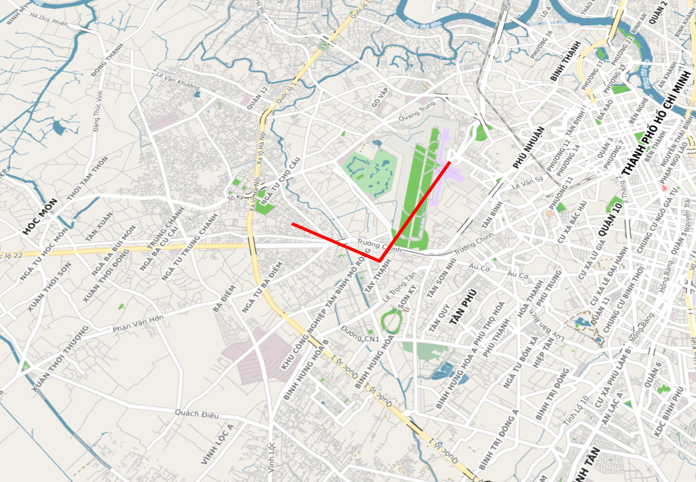

# Data layer
map4d cung cấp tính năng dùng để hiển thị dữ liệu không gian địa lý tùy ý. Bạn có thể sử dụng Data layer để vẽ GeoJSON lên bản đồ map4d.

## 1. Thêm feature vào data layer

Có 2 cách để thêm feature vào layer data.
1) Sử dụng hàm **addGeoJson**
2) Sử dụng hàm **add**

Giả sử ta có 1 GeoJSON như sau:

```json
{
  "type": "FeatureCollection",
  "features": [
    {
      "type": "Feature",
      "properties": {
        "stroke": "#555555",
        "stroke-width": 0,
        "stroke-opacity": 1,
        "fill": "#ff0000",
        "fill-opacity": 1
      },
      "geometry": {
        "type": "Polygon",
        "coordinates": [
          [
            [
              106.62574768066405,
              10.83802680397086
            ],
            [
              106.6278076171875,
              10.814421958289003
            ],
            [
              106.66248321533203,
              10.814421958289003
            ],
            [
              106.69750213623047,
              10.840724382155452
            ],
            [
              106.69132232666016,
              10.845107894830463
            ],
            [
              106.64051055908203,
              10.865338658847957
            ],
            [
              106.62574768066405,
              10.83802680397086
            ]
          ]
        ]
      }
    },
    {
      "type": "Feature",
      "properties": {
        "stroke": "#0000ff",
        "stroke-width": 5,
        "stroke-opacity": 1
      },
      "geometry": {
        "type": "LineString",
        "coordinates": [
          [
            106.68067932128905,
            10.869721810427496
          ],
          [
            106.64634704589844,
            10.801269881015028
          ]
        ]
      }
    },
    {
      "type": "Feature",
      "properties": {},
      "geometry": {
        "type": "Point",
        "coordinates": [
          106.68823242187499,
          10.852947478433613
        ]
      }
    },
    {
      "type": "Feature",
      "properties": {},
      "geometry": {
        "type": "Point",
        "coordinates": [
          106.6926097869873,
          10.824538548432923
        ]
      }
    }
  ]
}
```

Ta thêm feature vào layer data

```javascript
let features = this.map.data.addGeoJson(geojsonString)
```

Với **geojsonString** là chuỗi json được cung cấp ở trên.

 

Lưu ý: Hiện tại data layer chỉ hỗ trợ các kiểu sau:
1. Polygon
2. MultiPolygon
3. LineString
4. MultiLineString
5. Point

Ngoài ra chúng ta có thể sử dụng hàm **add** để thêm từng feature vào data layer.

```javascript
let geometry = new map4d.Data.LineString([[106.62574768066405, 10.83802680397086],
      [106.6278076171875, 10.814421958289003], [106.66248321533203, 10.814421958289003]])
let properties = {stroke: "#ff0000"}
let feature = this.map.data.add(new map4d.Data.Feature(1, geometry, properties))
```

Ta có thể thêm feature theo cách sau

```javascript
let geometry = new map4d.Data.LineString([[106.62574768066405, 10.83802680397086],
      [106.6278076171875, 10.814421958289003], [106.66248321533203, 10.814421958289003]])
let properties = {stroke: "#ff0000"}
let feature = this.map.data.add({id: 1, geometry: geometry, properties: properties})
```

 

map4d sdk cung cấp các kiểu dữ liệu geometry sau

```javascript
class LinearRing {
    constructor(elements: ILatLng[])
    elements: LatLng[]
}

class LineString implements Geometry {
    constructor(elements: ILatLng[])
    forEachLatLng(callback: (LatLng) => void): void
    getType(): string
}

class Polygon implements Geometry {
    constructor(element: LinearRing)
    forEachLatLng(callback: (LatLng) => void): void
    getType(): string
}

class MultiPolygon implements Geometry {
    constructor(elements: Data.Polygon[])
    forEachLatLng(callback: (LatLng) => void): void
    getAt(n: number): Data.Polygon
    getLength(): number
    getType(): string
}

class MultiLineString implements Geometry {
    constructor(elements: Data.LineString[])
    forEachLatLng(callback: (LatLng) => void): void
    getAt(n: number): Data.LineString
    getLength(): number
    getType(): string
}
```

## 2. Xóa feature khỏi data layer

Để xóa feature khỏi data layer chúng ta sử dụng hàm **remove**

```javascript
let geometry = new map4d.Data.LineString([[106.62574768066405, 10.83802680397086],
      [106.6278076171875, 10.814421958289003], [106.66248321533203, 10.814421958289003]])
let properties = {stroke: "#ff0000"}
// Thêm feature vào data layer
let feature = this.map.data.add({id: 1, geometry: geometry, properties: properties})
// Xóa feature khỏi data layer
this.map.data.remove(feature)

// Thêm 1 danh sách features vào data layer
let features = this.map.data.addGeoJson(geojsonString)
// Xóa tất cả features khỏi data layer
features.forEach(feature => this.map.data.remove(feature))
```

## 3. Xóa tất cả các feature khỏi data layer

Để xóa tất cả các feature khỏi data layer chúng ta sử dụng hàm **clear**

```javascript
this.map.data.clear()
```

## 4. Giá trị minZoom và maxZoom cho data layer

Chúng ta có thể set giá trị minZoom và maxZoom cho data layer:
* Giá trị minZoom quy định mức zoom nhỏ nhất mà data layer được phép hiện thị. Để set minZoom chúng ta sử dụng hàm **setMinZoom**
* Giá trị maxZoom quy định mức zoom lớn nhất mà data layer cho phép được hiển thị. Để set maxZoom chúng ta sử dụng hàm **setMaxZoom**

```javascript
let geometry = new map4d.Data.LineString([[106.62574768066405, 10.83802680397086],
      [106.6278076171875, 10.814421958289003], [106.66248321533203, 10.814421958289003]])
let properties = {stroke: "#ff0000"}
// Thêm feature vào data layer
let feature = this.map.data.add({id: 1, geometry: geometry, properties: properties})
// Xóa feature khỏi data layer
this.map.data.remove(feature)

// Thêm 1 danh sách features vào data layer
let features = this.map.data.addGeoJson(geojsonString)

// Set giá trị minZoom và maxZoom cho data layer
this.map.data.setMinZoom(14.0)
this.map.data.setMaxZoom(17.0)
```

Ngoài ra chúng ta có thể lấy giá trị minZoom và giá trị maxZoom của data layer thông qua hàm **getMinZoom** và **getMaxZoom**

```javascript
// Lấy giá trị minZoom của data layer
let minZoom = this.map.data.getMinZoom()

// Lấy giá trị maxZoom của data layer
let maxZoom = this.map.data.getMaxZoom()
```

## 5. Thêm sự kiện trên data layer

Sự kiện click phát sinh khi người dùng click vào feature trên data layer

```javascript
let clickEvent = this.map.data.addListener("click", (feature) => {
    console.log("Feature clicked: ")
    console.log(feature)
})

// Xóa event sau khi dùng xong
clickEvent.remove();
``` 

Ngoài ra map4d SDK còn hỗ trợ các loại sự kiện khác trên data layer như: hover, long click, right click...

License
-------

Copyright (C) 2016 IOT Link Ltd. All Rights Reserved.
