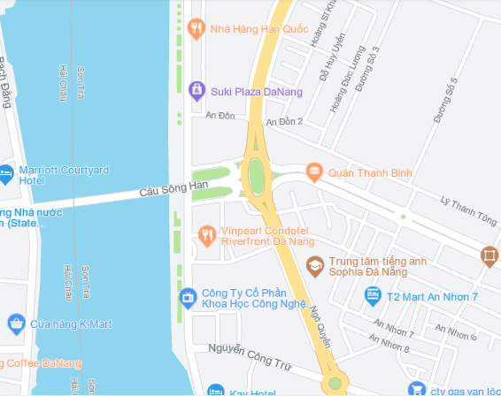
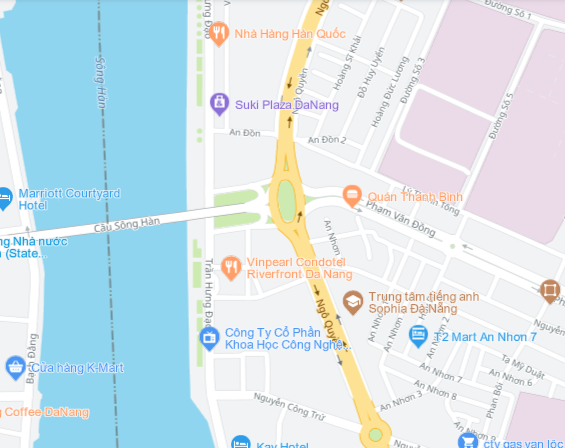

# Map Type

## Giới thiệu

>Map4D Web SDK cho phép tùy chỉnh kiểu hiển thị của Tile bản đồ theo hai chế độ (Raster và Roadmap).

### Các loại bản đồ

Map4D Web SDK  hiện cung cấp 2 loại bản đồ tùy chỉnh thông qua đối tượng `map4d.MapType` như bên dưới:

| No. | Name    | Description                                                                                                                                                           |
|:---:|---------|-----------------------------------------------------------------------------------------------------------------------------------------------------------------------|
|  1  | ROADMAP | Giá trị: `map4d.MapType.roadmap`<br>Các thành phần của bản đồ được vẽ dưới dạng các đường nét và hình khối, có độ phân giải cao<br>Đây là bản đồ mặc định của Map4D Web SDK |
|  2  | RASTER  | Giá trị: `map4d.MapType.raster`<br>Các tiles của bản đồ được hiển thị dưới dạng hình ảnh đã được dựng sẵn, tốc độ tải và hiển thị nhanh hơn so với Roadmap.                |

|                 ROADMAP                         | RASTER                                         |
|:-----------------------------------------------:|:----------------------------------------------:|
|  |  |

### Thay đổi kiểu bản đồ

Để thay kiểu bản đồ, ta gọi hàm `setMapType(mapType: IMapType)` thông qua đối tượng `map4d.Map` hoặc khởi tạo Map với thuộc
tính `mapType` của `map4d.MapOptions`

Ví dụ:
<iframe style="min-width: 900px;" height="500px" src="//jsfiddle.net/duydung2007/axnp2ebj//embedded/" allowfullscreen="allowfullscreen" allowpaymentrequest frameborder="0"></iframe>


### Get kiểu bản đồ hiện tại

Để get kiểu bản đồ hiện tại ta có thể gọi hàm `getMapType()` thông qua đối tượng `map4d.Map`. Giá trị trả về sẽ là một kiểu
của `map4d.MapType`

```javascript
map.getMapType()
```
