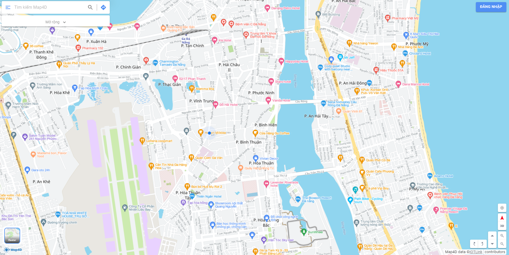

# Tile(Lấy thông tin của tile)
## 1. Bản đồ nền
MAP4D API cung cấp dữ liệu nền địa lý ở dạng raster
[](https://map4d.vn)

## 2. URL
```
https://api.map4d.vn/sdk/tile/raster/{z}/{x}/{y}?key={your-key}&mode={mode}
```
## 3. Phương Thức: GET
## 4. Input (Đầu vào)
| Parameter     |Required | Default  | Description |Ví dụ| 
|---------------|---------|----------|------------ |-----|
| mode          |No       | 2d       | Chế độ      |2d   |
| key           |Yes      | none     | Access key  |     |
| z             |Yes      | none     | Mức zoom    |3    |
| x             |Yes      | none     | Giá trị X   |29   |
| y             |Yes      | none     | Giá trị Y   |53   |

**Ví dụ**

https://api.map4d.vn/sdk/tile/raster/7/102/58?model=2d&key=samplekey


**Note:** Lưu ý rằng giá trị mode = "3d" chỉ tồn tại ở mức zoom từ 17+
