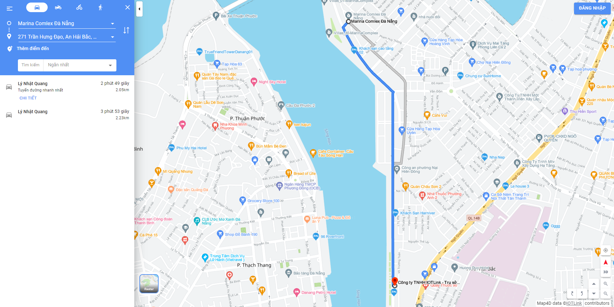

#  Route (Dẫn đường)
Tìm đường đi giữa 2 hoặc nhiều điểm đến theo các tùy chọn ngắn nhất, nhanh nhất và cân đối giữa quãng đường và thời gian. Hỗ trợ 4 loại phương tiện: ô tô, xe đạp, đi bộ và xe máy.

Phương thức: **GET**
## 1. Input (Đầu vào)
```
http://api.map4d.vn/sdk/route?key={key}&origin={origin}&destination={destination}&points={points}&mode={mode}&language={language}&weighting={weighting}&avoid={avoid}&avoidRoads={avoidRoads}
```
| Parameter   | Required | Description                                                                                                                                                                                                                                                                                                    |
|-------------|----------|----------------------------------------------------------------------------------------------------------------------------------------------------------------------------------------------------------------------------------------------------------------------------------------------------------------|
| key         | **Yes**  | apiKey - một mã định danh để xác thực các yêu cầu liên quan đến projects dùng trong việc sử dụng và thanh toán. Truy cập: https://map.map4d.vn/user/my-access-key/add để tạo key.                                                                                                                              |
| origin      | **Yes**  | Vị trí lat, lng của điểm bắt đầu. Ví dụ: 16.024634,108.209217                                                                                                                                                                                                                                                  |
| destination | **Yes**  | Vị trí lat, lng của điểm kết thúc. Ví dụ: 16.020179,108.211212                                                                                                                                                                                                                                                 |
| points      | No       | Danh sách các điểm trung gian muốn đi qua. <br>Gởi request từ 1 địa điểm trở lên. Nếu nhập từ 2 địa điểm trở lên thì phân cách giữa các địa điểm bởi dấu chấm phẩy ";". Ví dụ: 16.039173,108.210912;16.044597,108.217263<br>Số điểm tối đa là 25 điểm.                                                         |
| mode        | **Yes**  | Phương tiện đi qua, hiện tại hỗ trợ 4 loại phương tiện: car (xe hơi), bike (xe đạp), foot (đi bộ), motorcycle (xe máy).<br>Đối với 2 loại phương tiện là bike (xe đạp) và foot (đi bộ) thì thuộc tính tìm theo đường đi "ngắn nhất".                                                                           |
| language    | No       | Ngôn ngữ dùng chỉ đường, hiện tại hỗ trợ Tiếng Việt (vi) hoặc Tiếng Anh (en), mặc định sẽ là Tiếng Việt.                                                                                                                                                                                                       |
| weighting   | No       | Thuộc tính tìm theo đường đi "ngắn nhất" hay đường đi "nhanh nhất" hay đường đi "cân bằng giữa ngắn nhất và nhanh nhất",  mặc định là "nhanh nhất". <br>Nếu weighting = 0 là tìm đường đi ngắn nhất, nếu weighting = 1 là tìm đường đi nhanh nhất, nếu weighting = 2 là cân bằng giữa ngắn nhất và nhanh nhất. |
| avoid       | No       | Điểm/khu vực bị chặn, tuyến đường sẽ không đi qua đây. <br>Hỗ trợ các định dạng: <br> 1. lat,lng<br> 2. lat,lng,radius - Radius có đơn vị là mét, nhỏ hơn 50m và lớn hơn 0m <br> 3. lat1,lng1,lat2,lng2<br> 4. lat1,lng1,lat2,lng2,...,latN,lngN                                                               |
| avoidRoads  | No       | Danh sách loại đường cấm đi qua.<br>Hỗ trợ các loại đường: motorway,trunk,ferry,bridge,tunnel. Ví dụ: `motorway,trunk` hoặc `motorway,trunk,ferry,bridge,tunnel`<br>Nếu truyền param này thì sẽ bỏ qua 2 param `weighting` và `avoid`.                                                                         |
## 2. Output (Đầu ra)
```json
{
  "code": "string",
  "message": "string",
  "result": {
    "routes": [
      {
        "legs": [
          {
            "distance": {
              "text": "string",
              "value": 0
            },
            "duration": {
              "text": "string",
              "value": 0
            },
            "endAddress": "string",
            "startAddress": "string",
            "endLocation": {
              "lng": 0,
              "lat": 0
            },
            "startLocation": {
              "lng": 0,
              "lat": 0
            },
            "steps": [
              {
                "distance": {
                  "text": "string",
                  "value": 0
                },
                "duration": {
                  "text": "string",
                  "value": 0
                },
                "endLocation": {
                  "lng": 0,
                  "lat": 0
                },
                "startLocation": {
                  "lng": 0,
                  "lat": 0
                },
                "htmlInstructions": "string",
                "maneuver": "string",
                "polyline": "string",
                "travelMode": "car",
                "streetName": "string"
              }
            ]
          }
        ],
        "overviewPolyline": "string",
        "summary": "string",
        "distance": {
          "text": "string",
          "value": 0
        },
        "duration": {
          "text": "string",
          "value": 0
        },
        "snappedWaypoints": [
          {
            "lng": 0,
            "lat": 0
          }
        ]
      }
    ]
  }
}
```
| Parameter        | Required | Description                                                                                                                                       |
|------------------|----------|---------------------------------------------------------------------------------------------------------------------------------------------------|
| code             | **Yes**  | Mã trả về thành công hoặc lỗi.<br>Nếu trả về mã code "ok" nghĩa là thành công.<br>Ngược lại, nếu lỗi thì trả về mã lỗi tương ứng.                 |
| message          | No       | Nội dung của mã lỗi (nếu có).                                                                                                                     |
| result           | No       | Đường đi tương ứng với các params truyền vào, nếu lỗi thì result là "null".                                                                       |
| routes           | No       | Danh sách các đường đi.                                                                                                                           |
| legs             | **Yes**  | Danh sách đoạn đường để đi qua điểm trung gian `points`.                                                                                          |
| distance         | **Yes**  | Khoảng cách về "km" mỗi địa điểm đi qua (khoảng cách dưới dạng `text`, còn `value` là giá trị - đơn vị là mét).                                   |
| duration         | **Yes**  | Khoảng cách về "thời gian" mỗi địa điểm đi qua (thời gian dưới dạng `text`, còn `value` là thời gian khi đi trên đoạn đường đó - đơn vị là giây). |
| endAddress       | No       | Địa chỉ kết thúc mỗi điểm.                                                                                                                        |
| startAddress     | No       | Địa chỉ bắt đầu mỗi điểm.                                                                                                                         |
| endLocation      | **Yes**  | Vị trí lat, lng kết thúc tương ứng với địa chỉ kết thúc `endAddress`.                                                                             |
| startLocation    | **Yes**  | Vị trí lat, lng bắt đầu tương ứng với địa chỉ kết thúc `startAddress`.                                                                            |
| steps            | **Yes**  | Danh sách các bước dẫn đường.                                                                                                                     |
| htmlInstructions | No       | Mô tả các bước dẫn đường dạng html.                                                                                                               |
| maneuver         | **Yes**  | Hướng chuyển đổi. Ví dụ: rẽ trái, rẽ phải, đi thẳng,...                                                                                           |
| polyline         | **Yes**  | Đường đi từng điểm dưới dạng mã hóa polyline làm tròn 5 ký tự.                                                                                    |
| travelMode       | **Yes**  | Phương tiện đi tương ứng với phương tiện đã truyền request `mode`.                                                                                |
| streetName       | No       | Tên đường đi.                                                                                                                                     |
| overviewPolyline | **Yes**  | Thông tin dạng mã hóa các điểm đi, dưới dạng tổng quát polyline.                                                                                  |
| summary          | No       | Tóm lược đường đi (khoảng cách `distance` và thời gian di chuyển `duration`).                                                                     |
| snappedWaypoints | No       | Danh sách các điểm đi qua trên đường, từ địa điểm bắt đầu và điểm đi qua tới điểm kết thúc.                                                       |

[](https://map4d.vn)

**Ví dụ**
<iframe src="./examples/v1.0/route.html" height="600px"> </iframe>

## 3. Code sample

Dưới đây là ví dụ về decode polyline
<iframe src="//jsfiddle.net/thanhnghiacntt/9w3uq0ry/embedded/" style="min-width: 960px;" height="540px"></iframe>