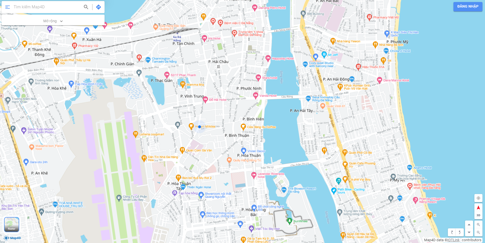

# Tile (Lấy thông tin của tile)
Map4D API cung cấp dữ liệu nền địa lý ở dạng "raster".

Phương thức: **GET**

Bản đồ nền
[](https://map4d.vn)

## 1. Input (Đầu vào)
```
https://api.map4d.vn/sdk/tile/raster/{z}/{x}/{y}?key={key}&mode={mode}
```
| Parameter | Required | Description                                                                                                                                                                       |
|-----------|----------|-----------------------------------------------------------------------------------------------------------------------------------------------------------------------------------|
| key       | **Yes**  | apiKey - một mã định danh để xác thực các yêu cầu liên quan đến projects dùng trong việc sử dụng và thanh toán. Truy cập: https://map.map4d.vn/user/my-access-key/add để tạo key. |
| z         | **Yes**  | Mức zoom của map.                                                                                                                                                                 |
| x         | **Yes**  | Tọa độ x (Giá trị x).                                                                                                                                                             |
| y         | **Yes**  | Tọa độ y (Giá trị y).                                                                                                                                                             |
| mode      | No       | Có 2 chế độ là "2d" và "3d". Mặc định là "2d".                                                                                                                                    |

**Note:** Giá trị `mode` = "3d" chỉ tồn tại ở mức zoom từ 17+
## 2. Output (Đầu ra)
```text
Trả về nội dung mã hóa file ảnh dạng .PNG.
```

**Ví dụ**

https://api.map4d.vn/sdk/tile/raster/7/102/58?model=2d&key=samplekey