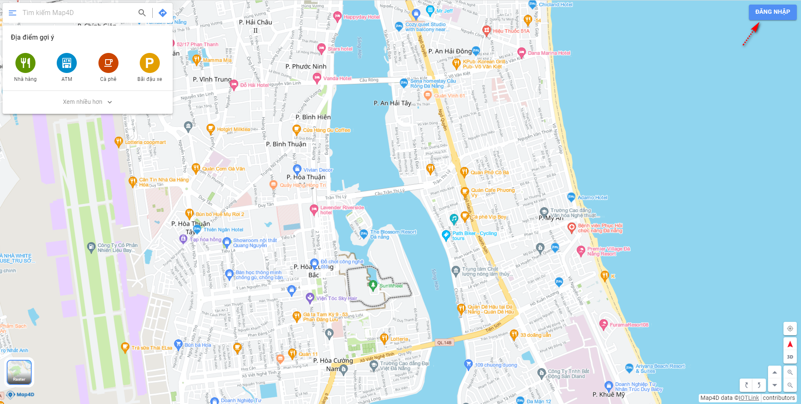
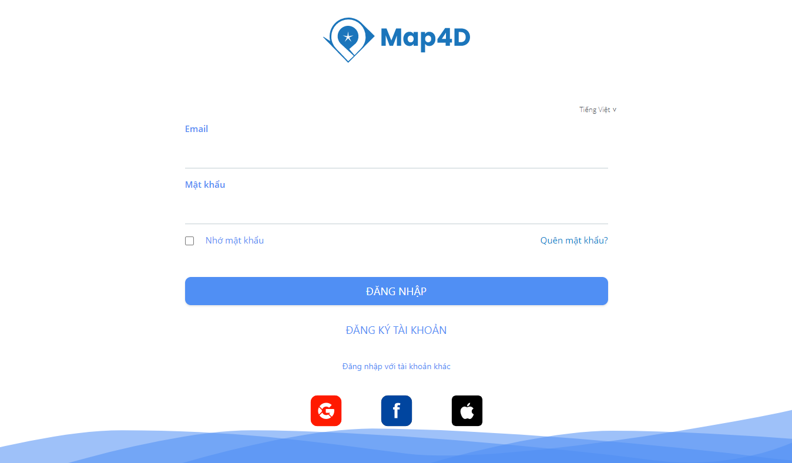
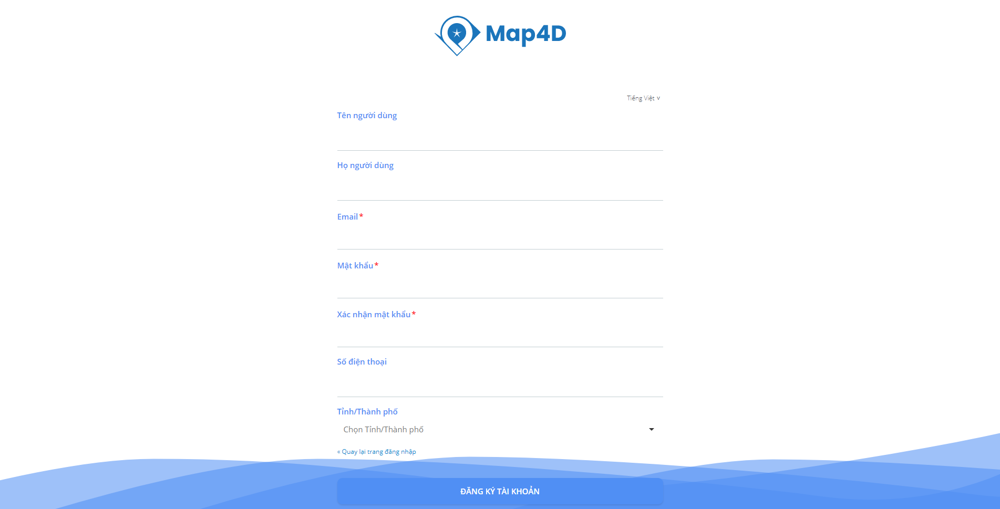
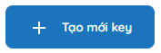

## Cách tạo key trên Map4D
**B1:** Chọn vào nút chức năng "ĐĂNG NHẬP"  ngay trên góc phải màn hình chính của bản đồ Map4D để đăng nhập.

Nếu chưa có tài khoản, chọn “ĐĂNG KÝ TÀI KHOẢN” để vào chức năng đăng ký tài khoản người dùng hoặc đăng ký tài khoản bằng cách login vào tài khoản Google/Facebook/Apple ID.

**B2:** Sau khi đăng nhập thành công vào Map4D, bấm vào logo  ở góc phải màn hình tại màn hình chính Map4D để mở bảng Menu.

**B3:** Trên Menu chức năng, chọn "Nhà phát triển" tại màn hình Map4D User để vào chức năng quản lý nhà phát triển. 

**B4:** Tại trang chủ của "Nhà phát triển", bấm vào menu "Key" để vào màn hình "Access key của tôi".

Trường hợp user mới và chưa có key nào được tạo, bảng Access key của tôi sẽ trống.

**B5:** Chọn nút lệnh  ngay trên góc phải màn hình danh sách Access key của tôi để gọi chức năng tạo mới một key.

**B6:** Chọn radio button "Cài đặt hạn chế sử dụng" tại màn hình "Thêm mới key" để cài đặt hạn chế sử dụng key.

**Nhập các thông tin key của tôi:**
 - Tên: Là tên key (Tên gợi nhớ vào mục đích sử dụng riêng của user).
 - Ngày kết thúc: Ngày cuối cùng key có thể sử dụng được trên hệ thống Map4D. 
 
 Trường hợp không chọn ngày, key sẽ hết hạn khi đạt mức request tối đa cho phép.
 - Mô tả: Mô tả thông tin của key. 
 - Loại dịch vụ: Là loại dịch vụ cho phép key người dùng sử dụng. 
 
 Có thể chọn một hoặc nhiều loại dịch vụ cùng lúc:

    Địa điểm: Cho phép key có quyền sử dụng các dịch vụ nhóm loại dịch vụ địa điểm.

    Bản đồ: Cho phép key có quyền truy cập các dịch vụ nhóm loại dịch vụ bản đồ.

    Tìm đường: Cho phép key có quyền truy cập nhóm dịch vụ tuyến đường.

- Giới hạn ứng dụng: Là các hạn chế ứng dụng: kiểm soát các trang web, địa chỉ Ips hoặc ứng dụng nào có thể sử dụng khóa - access key, …

    AndroidApps: Hạn chế sử dụng cho các ứng dụng Android của user theo Android Package name.

    HttpReferrers: Hạn chế các yêu cầu sử dụng chính đối với các trang web được chỉ định.

    IPs: Chấp nhận yêu cầu từ các địa chỉ IP của máy chủ này. 
    
    Chỉ định một IPv4 hoặc IPv6 hoặc mạng con sử dụng ký hiệu CIDR (ví dụ: 192.168.0.0/22). Ví dụ: 192.168.0.1, 172.16.0.0/12
    
    IosApps: Chấp nhận yêu cầu từ các ứng dụng IOS với một trong các "App Ids" hoặc "Bundle identifiers".

- Môi trường: Là môi trường cho phép sử dụng key của người dùng, Map4D hỗ trợ các môi trường chính: Development, Apple Store/Google Play Store và Không xác định.

**B7:** Chọn vào nút chức năng “LƯU” key  khi đã hoàn thành các thông tin cần thiết. 

Hệ thống tự động trở về màn hình danh sách Access key của tôi.