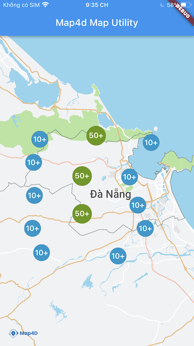

# Marker Clustering

> Map4dMapUtils utility library cung cấp các tiện ích để xử lý việc hiển thị một số lượng lớn các điểm lên bản đồ Map4D.



## Usage

Map4dMapUtils cung cấp lớp [MFClusterManager](https://pub.dev/documentation/map4d_map_utils/latest/map4d_map_utils/MFClusterManager-class.html) để quản lý các điểm và nhóm chúng lại theo từng mức zoom của bản đồ.  
Các điểm trong cụm phải được thêm vào bản đồ thông qua cluster manager, bằng các khai báo đối tượng [MFClusterItem](https://pub.dev/documentation/map4d_map_utils/latest/map4d_map_utils/MFClusterItem-class.html) và thêm vào bằng phương thức [addItem](https://pub.dev/documentation/map4d_map_utils/latest/map4d_map_utils/MFClusterManager/addItem.html) hoặc [addItems](https://pub.dev/documentation/map4d_map_utils/latest/map4d_map_utils/MFClusterManager/addItems.html).  

[MFClusterManager](https://pub.dev/documentation/map4d_map_utils/latest/map4d_map_utils/MFClusterManager-class.html) yêu cầu [controller](https://pub.dev/documentation/map4d_map/latest/map4d_map/MFMapViewController-class.html) của [MFMapView](https://pub.dev/documentation/map4d_map/latest/map4d_map/MFMapView-class.html) instance, để xác định bản đồ sẽ hiển thị các cụm địa điểm.

- Ví dụ: tạo cluster manager tại sự kiện `onMapCreated` của map view:

```dart
void onMapCreated(MFMapViewController controller) {
  final clusterManager = MFClusterManager(
    controller: controller,
    onClusterTap: (cluster) => onClusterTap(cluster, controller)
  );
  // Add cluster item
  final item = MFClusterItem(position: MFLatLng(16.0432432, 108.032432));
  clusterManager.addItem(item);
  // Arrange items into groups
  clusterManager.cluster();
}
```

## MFClusterManager

### Constructors

```dart
MFClusterManager({
  required this.controller,
  this.algorithm = const MFNonHierarchicalDistanceBasedAlgorithm(),
  this.renderer = const MFDefaultClusterRenderer(),
  this.onClusterTap,
  this.onClusterItemTap,
});
```

### Properties

| Name | Type | Description |
|---|---|---|
| controller | [MFMapViewController](https://pub.dev/documentation/map4d_map/latest/map4d_map/MFMapViewController-class.html) | Controller của MapView dùng để hiển thị các cluster item |
| algorithm | [MFClusterAlgorithm](https://pub.dev/documentation/map4d_map_utils/latest/map4d_map_utils/MFClusterAlgorithm-class.html) | Thuật toán phân nhóm các cụm cluster item |
| renderer | [MFClusterRenderer](https://pub.dev/documentation/map4d_map_utils/latest/map4d_map_utils/MFClusterRenderer-class.html) | Trình hiển thị các cụm cluster item |
| onClusterTap | [MFClusterCallback](https://pub.dev/documentation/map4d_map_utils/latest/map4d_map_utils/MFClusterCallback.html) | Sự kiện được gọi khi người dùng touch vào cụm nhiều cluster item |
| onClusterItemTap | [MFClusterItemCallback](https://pub.dev/documentation/map4d_map_utils/latest/map4d_map_utils/MFClusterItemCallback.html) | Sự kiện được gọi khi người dùng touch vào cluster item đơn lẻ |

### Methods

| Name | Return Type | Arguments | Description |
|---|---|---|---|
| addItem | [Future](https://api.dart.dev/stable/2.15.0/dart-async/Future-class.html)\<void\> | [MFClusterItem](https://pub.dev/documentation/map4d_map_utils/latest/map4d_map_utils/MFClusterItem-class.html) item | Thêm một item vào danh sách. Lỗi nếu item đã được thêm vào trước đó. |
| addItems | [Future](https://api.dart.dev/stable/2.15.0/dart-async/Future-class.html)\<void\> | [List](https://api.dart.dev/stable/2.15.0/dart-core/List-class.html)\<[MFClusterItem](https://pub.dev/documentation/map4d_map_utils/latest/map4d_map_utils/MFClusterItem-class.html)\> items | Thêm nhiều item vào danh sách. Lỗi nếu item đã được thêm vào trước đó. |
| removeItem | [Future](https://api.dart.dev/stable/2.15.0/dart-async/Future-class.html)\<void\> | [MFClusterItem](https://pub.dev/documentation/map4d_map_utils/latest/map4d_map_utils/MFClusterItem-class.html) item | Xóa item chỉ định khỏi danh sách. Lỗi nếu xóa item không tồn tại. |
| clearItems | [Future](https://api.dart.dev/stable/2.15.0/dart-async/Future-class.html)\<void\> |  | Xóa toàn bộ cluster item. |
| cluster | [Future](https://api.dart.dev/stable/2.15.0/dart-async/Future-class.html)\<void\> |  | Sắp xếp các item theo nhóm. Cluster Manager sẽ tự động sắp xếp item theo nhóm khi mức zoom của map thay đổi.<br> Tuy nhiên, nếu thêm mới hoặc loại bỏ item khỏi danh sách thì cần phải gọi phương thức này thủ công để cập nhật lại các nhóm item đang hiển thị trên bản đồ. |


## Example

* Ví dụ hiển thị 500 cluster item ngẫu nhiên ngay sau khi map4d hiển thị:

```dart
import 'dart:math';
import 'package:flutter/material.dart';
import 'package:map4d_map/map4d_map.dart';
import 'package:map4d_map_utils/map4d_map_utils.dart';

void main() {
  runApp(const MyApp());
}

class MyApp extends StatelessWidget {
  const MyApp({Key? key}) : super(key: key);
  final int maxClusterItemCount = 500;
  final double cameraLatitude = 16.0432432;
  final double cameraLongitude = 108.032432;

  @override
  Widget build(BuildContext context) {
    return MaterialApp(
      title: 'Map4D Map Utility',
      home: MFMapView(
        initialCameraPosition: MFCameraPosition(
            target: MFLatLng(cameraLatitude, cameraLongitude), zoom: 10),
        onMapCreated: onMapCreated,
      ),
    );
  }

  void onMapCreated(MFMapViewController controller) {
    final clusterManager = MFClusterManager(
      controller: controller,
      onClusterTap: (cluster) => onClusterTap(cluster, controller)
    );
    // Generate cluster items
    const double extent = 0.2;
    for (int i = 0; i < maxClusterItemCount; i++) {
      double lat = cameraLatitude + extent * (Random().nextDouble() * 2.0 - 1.0);
      double lng = cameraLongitude + extent * (Random().nextDouble() * 2.0 - 1.0);
      final item = MFClusterItem(position: MFLatLng(lat, lng));
      clusterManager.addItem(item);
    }
    // Arrange items into groups
    clusterManager.cluster();
  }

  void onClusterTap(MFCluster cluster, MFMapViewController controller) async {
    final zoom = await controller.getZoomLevel();
    controller.animateCamera(MFCameraUpdate.newLatLngZoom(cluster.position, zoom + 1));
  }
}
```

Xem thêm: <https://github.com/map4d/map4d-map-flutter-utils/blob/master/example/lib/main.dart>